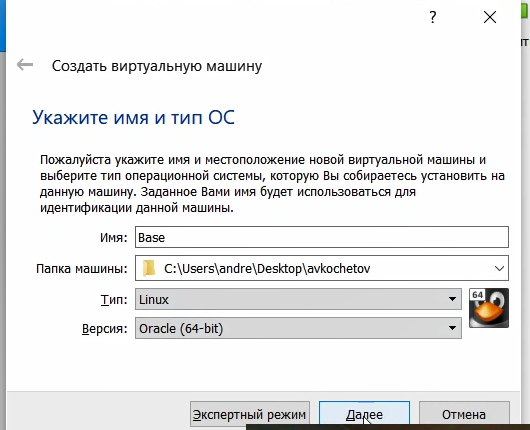
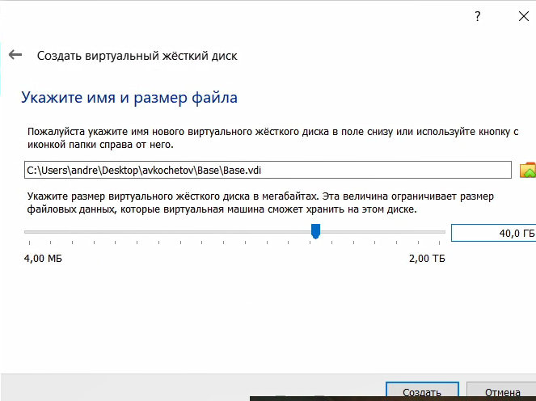
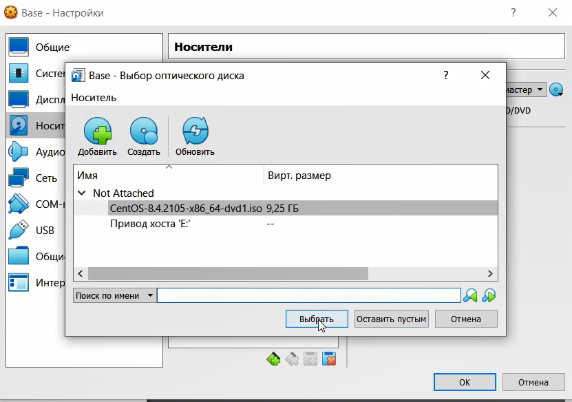
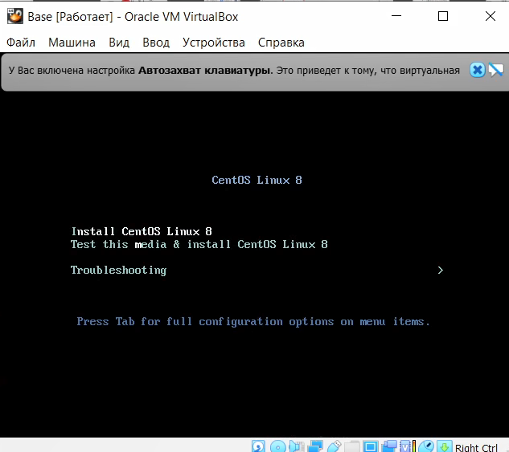
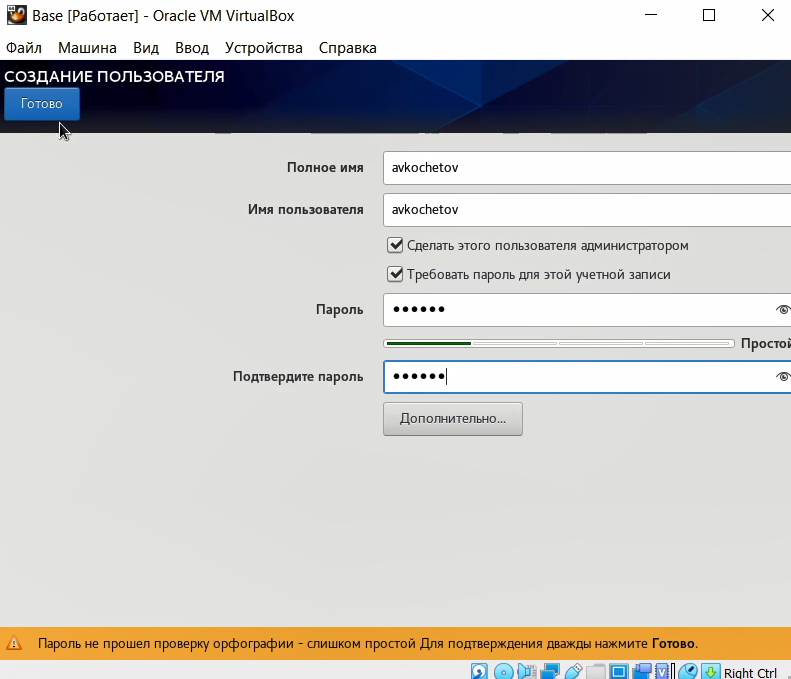
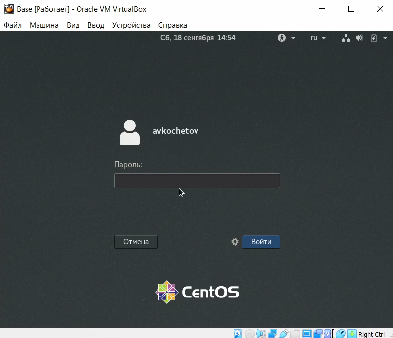
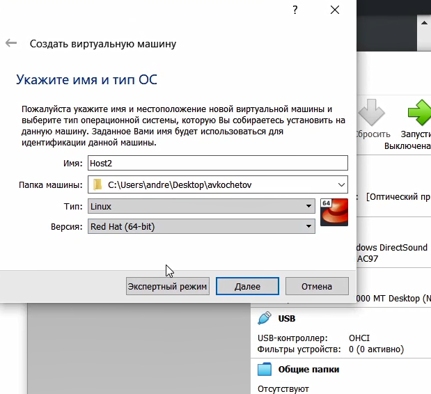

---
## Front matter
lang: ru-RU
title: Отчёт по лабораторной работе 1
author: 'Кочетов Андрей Владимирович'
date: 18 сентября, 2021

## Formatting
toc: false
slide_level: 2
theme: metropolis
mainfont: PT Serif
romanfont: PT Serif
sansfont: PT Sans
monofont: PT Mono
header-includes: 
 - \metroset{progressbar=frametitle,sectionpage=progressbar,numbering=fraction}
 - '\makeatletter'
 - '\beamer@ignorenonframefalse'
 - '\makeatother'
aspectratio: 43
section-titles: true
---

## Цель работы

Приобретение практических навыков установки операционной системы на виртуальную машину, настройки минимально необходимых для дальнейшей работы сервисов.

## Задание

Лабораторная работа подразумевает установку на виртуальную машину VirtualBox операционной системы Linux, дистрибутив Centos.

# Выполнение лабораторной работы

1. Запустил Virtual box, создал новую виртуальную машину с именем **_Base_**: выбрал тип операционной системы _Linux_ (рис.1).

   { #fig:001 width=50% }

---

2. Указал объем памяти 1024 МБ, задал конфигурацию жесткого диска, создал новый динамический виртуальный жёсткий диск типа VDI, а также установил размер диска - 40 ГБ и его расположение (рис.2).

   { #fig:002 width=60% }

---

3. Добавил во вкладке _"Носители"_ свойств виртулальной машины новый привод оптических дисков, выбрал нужный образ для установки операционной системы (рис.3).

   { #fig:003 width=60% }

---

4. Запустил созданную виртуальную машину и начинал установку. В открытом окне выбирал русский язык как язык интерфейса (рис.4).

   { #fig:004 width=60% }

---

5. Делаю настройку установки и создаю нового пользователя с правами администратора, задаю пароль (рис.5).

   { #fig:005 width=60% }

---

6. Принимаю лицензионное соглашение и вижу готовую к работе машину(рис.6).

   { #fig:006 width=60% }

---

7. Меняю конфигурацию виртуальной машины, чтобы на ее основе создать новую вируальную машину и создаю ее (рис.7).

   { #fig:007 width=60% }

# Выводы

Приобрел практические навыков установки операционной системы на виртуальную машину, настройки минимально необходимых для дальнейшей работы сервисов.

## {.standout}

Спасибо за внимание
