---
# Front matter
lang: ru-RU
title: 'Отчёт'
subtitle: 'по лабораторной работе 1'
author: 'Кочетов Андрей Владимирович'

# Formatting
toc-title: 'Содержание'
toc: true # Table of contents
toc_depth: 2
lof: true # List of figures
lot: true # List of tables
fontsize: 12pt
linestretch: 1.5
papersize: a4paper
documentclass: scrreprt
polyglossia-lang: russian
polyglossia-otherlangs: english
mainfont: Ubuntu
romanfont: Ubuntu
sansfont: Ubuntu
monofont: Ubuntu
mainfontoptions: Ligatures=TeX
romanfontoptions: Ligatures=TeX
sansfontoptions: Ligatures=TeX,Scale=MatchLowercase
monofontoptions: Scale=MatchLowercase
indent: true
pdf-engine: lualatex
header-includes:
  - \linepenalty=10 # the penalty added to the badness of each line within a paragraph (no associated penalty node) Increasing the value makes tex try to have fewer lines in the paragraph.
  - \interlinepenalty=0 # value of the penalty (node) added after each line of a paragraph.
  - \hyphenpenalty=50 # the penalty for line breaking at an automatically inserted hyphen
  - \exhyphenpenalty=50 # the penalty for line breaking at an explicit hyphen
  - \binoppenalty=700 # the penalty for breaking a line at a binary operator
  - \relpenalty=500 # the penalty for breaking a line at a relation
  - \clubpenalty=150 # extra penalty for breaking after first line of a paragraph
  - \widowpenalty=150 # extra penalty for breaking before last line of a paragraph
  - \displaywidowpenalty=50 # extra penalty for breaking before last line before a display math
  - \brokenpenalty=100 # extra penalty for page breaking after a hyphenated line
  - \predisplaypenalty=10000 # penalty for breaking before a display
  - \postdisplaypenalty=0 # penalty for breaking after a display
  - \floatingpenalty = 20000 # penalty for splitting an insertion (can only be split footnote in standard LaTeX)
  - \raggedbottom # or \flushbottom
  - \usepackage{float} # keep figures where there are in the text
  - \floatplacement{figure}{H} # keep figures where there are in the text
---

# Цель работы

Приобретение практических навыков установки операционной системы на виртуальную машину, настройки минимально необходимых для дальнейшей работы сервисов.

# Задание

Лабораторная работа подразумевает установку на виртуальную машину VirtualBox операционной системы Linux, дистрибутив CentOS.

# Выполнение лабораторной работы

1. Запустил Virtual box, создал новую виртуальную машину с именем **_Base_**: выбрал тип операционной системы _Linux_ (рис.1).

   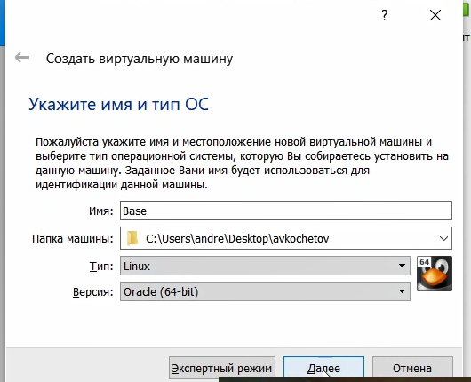{ #fig:001 width=60% }

2. Указал объем памяти 1024 МБ, задал конфигурацию жесткого диска, создал новый динамический виртуальный жёсткий диск типа VDI, а также установил размер диска - 40 ГБ и его расположение (рис.2-6).

   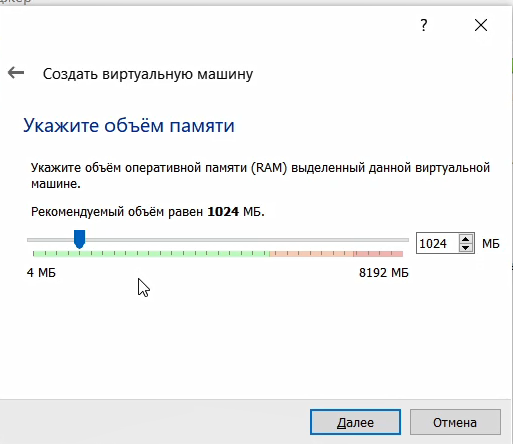{ #fig:002 width=60% }

   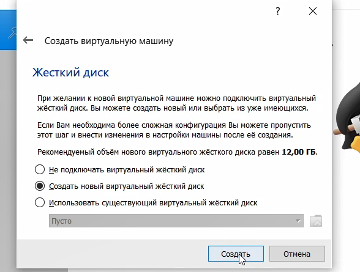{ #fig:003 width=60% }

   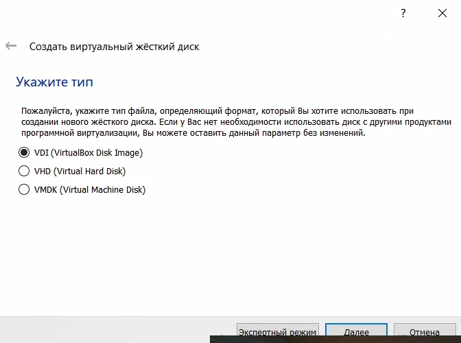{ #fig:004 width=60% }

   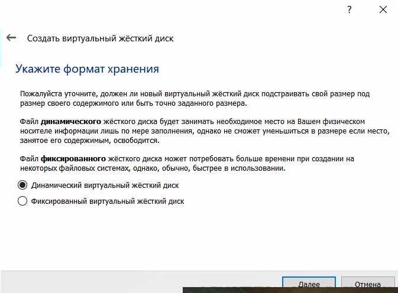{ #fig:005 width=60% }

   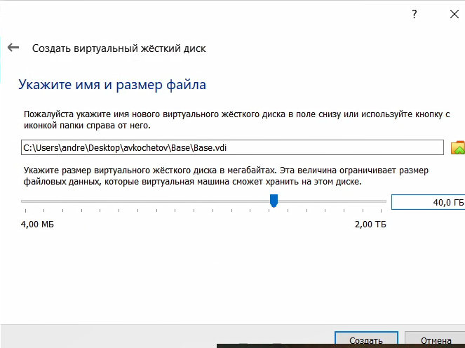{ #fig:006 width=60% }

3. Добавил во вкладке _"Носители"_ свойств виртулальной машины новый привод оптических дисков, выбрал нужный образ для установки операционной системы (рис.7).

   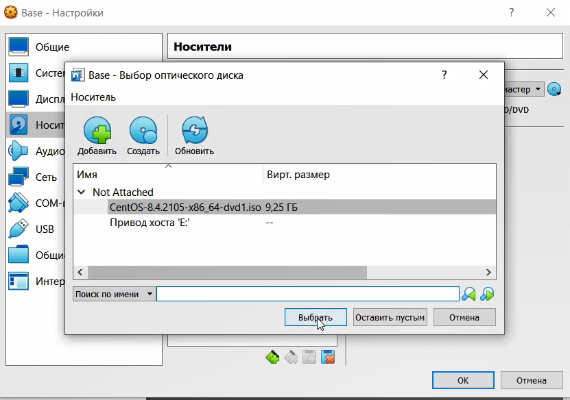{ #fig:007 width=60% }

4. Запустил созданную виртуальную машину и начинал установку. В открытом окне выбирал русский язык как язык интерфейса (рис.8).

   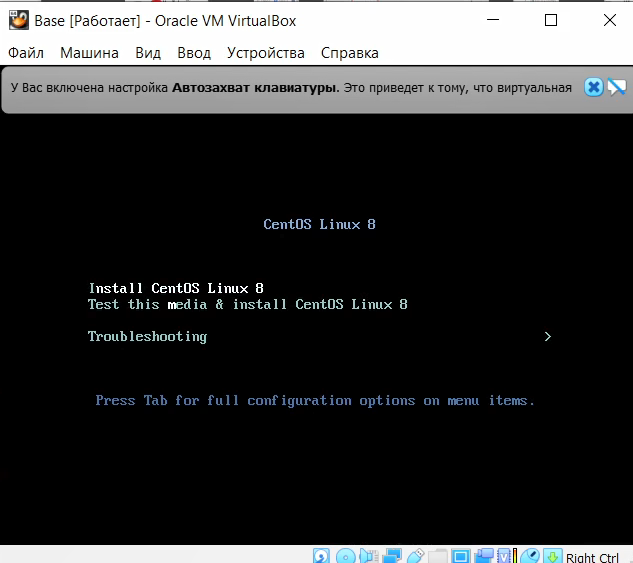{ #fig:008 width=60% }

5. Делаю настройку установки (рис.9).

   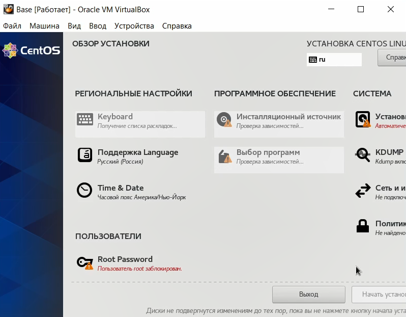{ #fig:009 width=60% }

6. Создаю нового пользователя с правами администратора, задаю пароль (рис.10).

   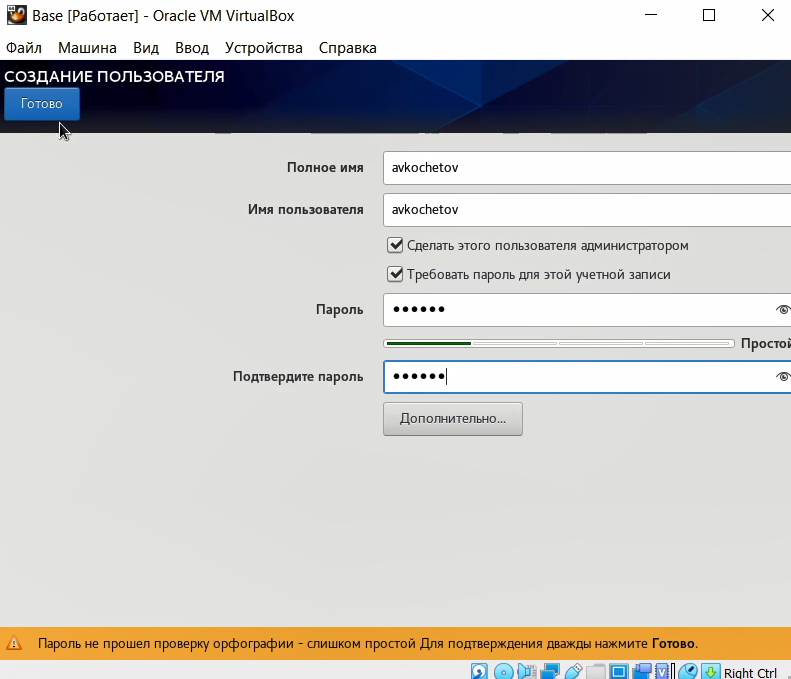{ #fig:010 width=60% }

7. Запускаю установку (рис.11).

   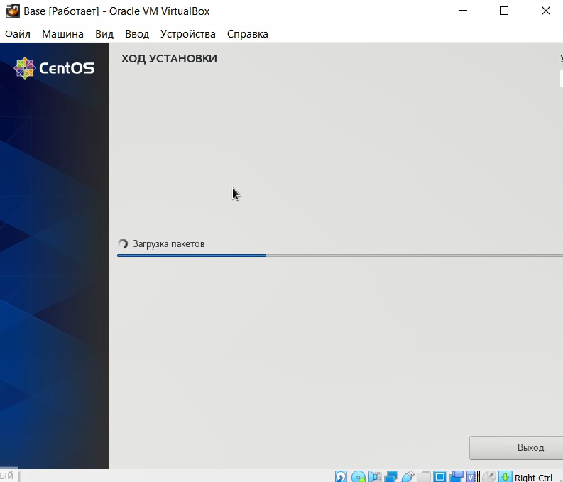{ #fig:011 width=60% }

8. Принимаю лицензионное соглашение и вижу готовую к работе машину(рис.12-13).

   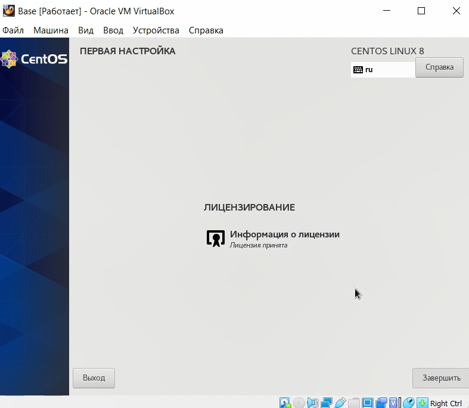{ #fig:012 width=60% }
   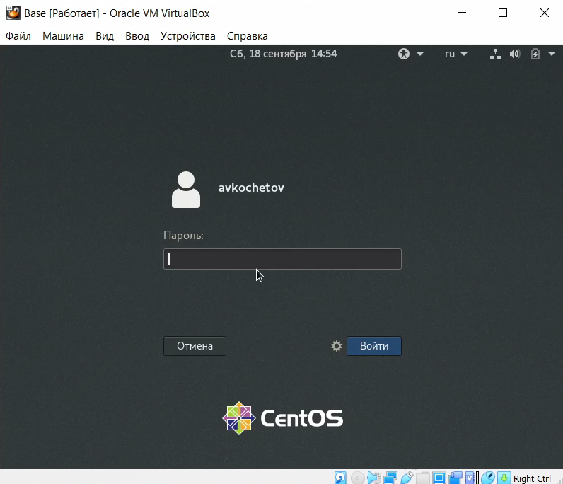{ #fig:013 width=60% }

9. Вхожу в профиль и устанавливаю драйвера (рис.14).

   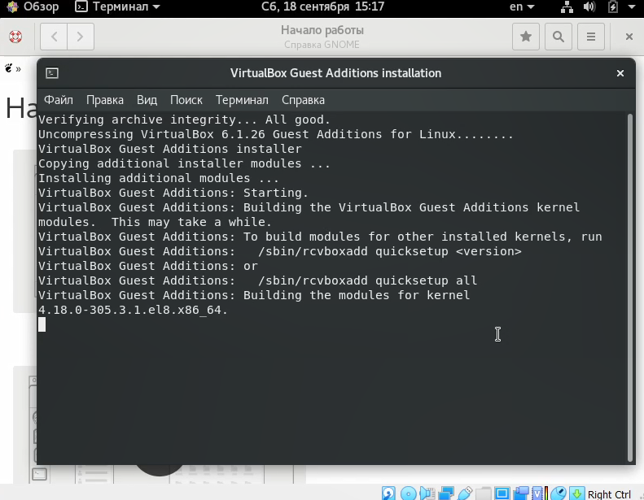{ #fig:014 width=60% }

10. Меняю конфигурацию виртуальной машины, чтобы на ее основе создать новую вируальную машину и создаю ее (рис.15-16).

   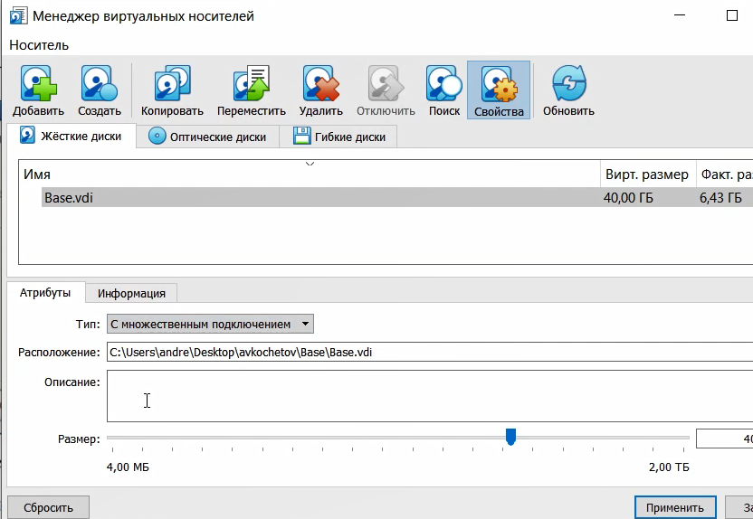{ #fig:015 width=60% }
   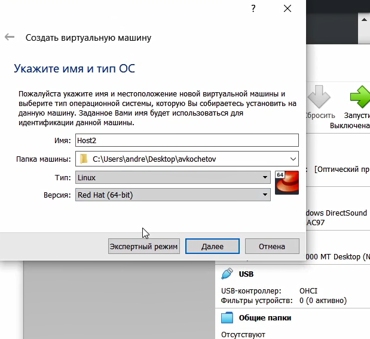{ #fig:016 width=60% }

# Выводы

Приобрел практические навыки установки операционной системы на виртуальную машину, настройки минимально необходимых для дальнейшей работы сервисов.
