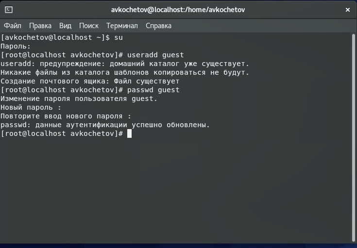
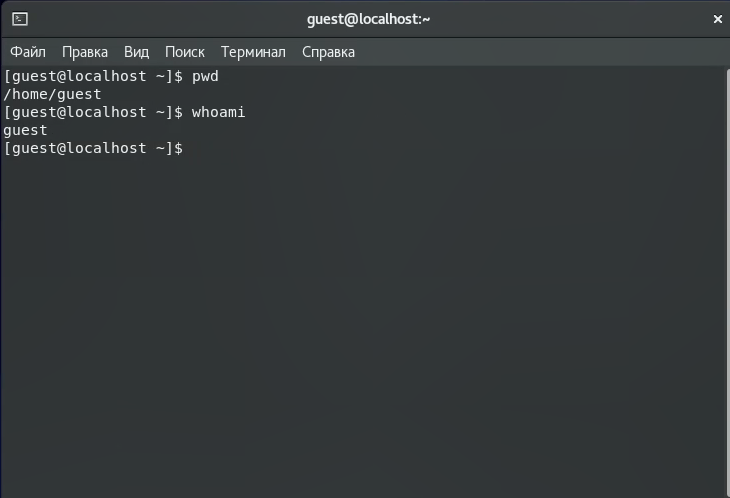
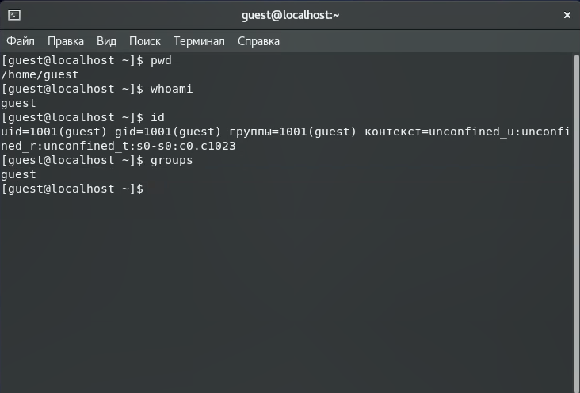
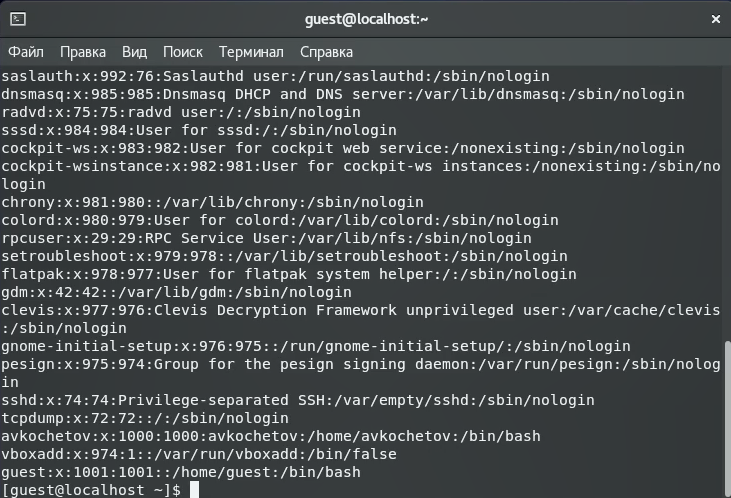
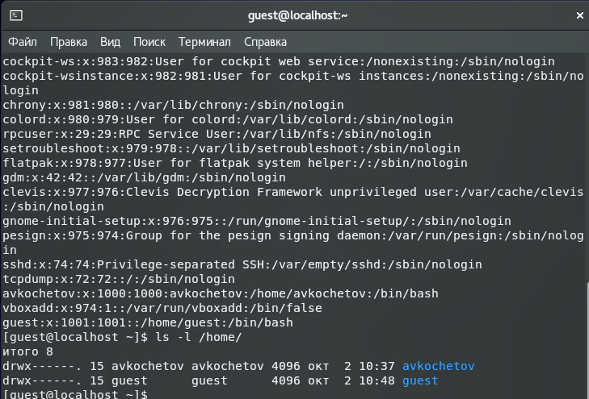
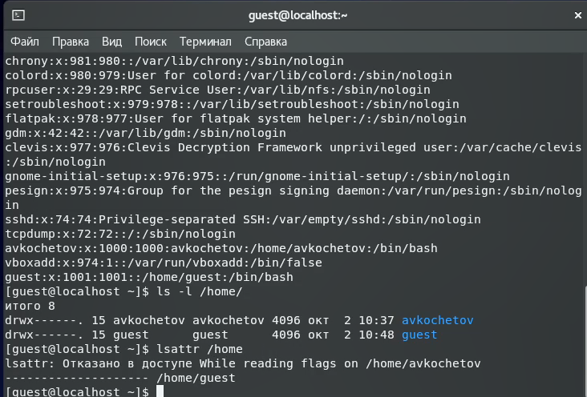
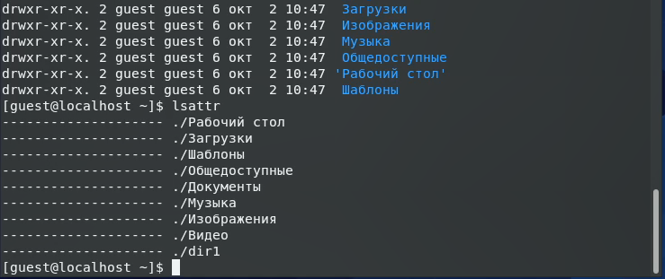
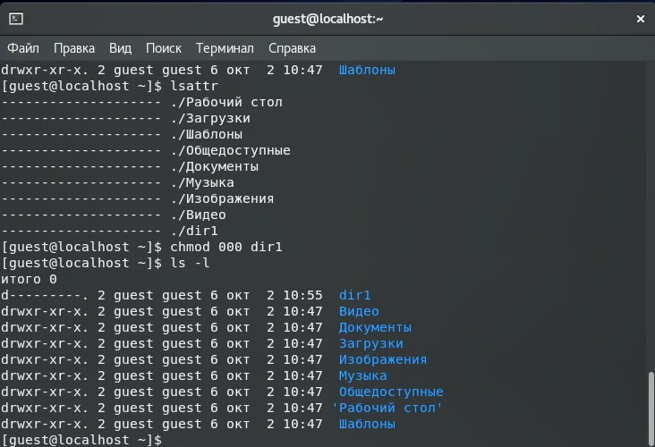
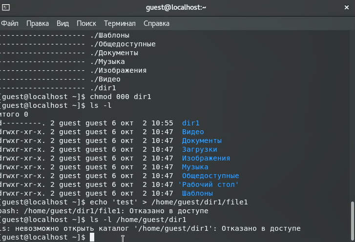

---
## Front matter
lang: ru-RU
title: Отчёт по лабораторной работе 2
author: 'Кочетов Андрей Владимирович'
date: 02 октября, 2021

## Formatting
toc: false
slide_level: 2
theme: metropolis
mainfont: PT Serif
romanfont: PT Serif
sansfont: PT Sans
monofont: PT Mono
header-includes: 
 - \metroset{progressbar=frametitle,sectionpage=progressbar,numbering=fraction}
 - '\makeatletter'
 - '\beamer@ignorenonframefalse'
 - '\makeatother'
aspectratio: 43
section-titles: true
---

## Цель работы

Получение практических навыков работы в консоли с атрибутами файлов, закрепление теоретических основ дискреционного разграничения доступа в современных системах с открытым кодом на базе ОС Linux.

## Задание

Лабораторная работа подразумевает создание нового пользователя, работу с директориями, сравнение пользователей, настройку прав и заполение таблиц прав.

# Выполнение лабораторной работы

1. Создаю новую учетную запись guest и задаю к ней пароль(рис.1).

   { #fig:001 width=60% }

---

2. Определил директорию при помощи команды pwd, убедился, что нахожусь в домашней директории и уточнил имя пользователя командой whoami(рис.2).

   { #fig:002 width=60% }

---

3. Уточнил имя пользователя, его группу, а также группы, куда входит пользователь, командой id и сравнил значения с командой groups(рис.3).
   Команда groups выводит те группы, в которых состоит наш пользователь. Сравнил. Можно сделать вывод, что эти команды выдают одинаковые значения.

   { #fig:003 width=60% }

---

4. Просмотрел файл /etc/passwd командой cat /etc/passwd(рис.4).
   Нашел свою учётную запись. Определил uid, gid пользователя. Сравнил значения. Они совпадают.

   { #fig:004 width=60% }

---

5. Определил существующие в системе директории командой ls -l /home/(рис.5).
   Удалось определить существующие поддиректории директории /home.
   Флаг «d» говорит, что guest и avkochetov – это каталоги. Для обоих каталогов – полные права (rwx).

   { #fig:005 width=60% }

---

6. Проверил, какие расширенные атрибуты установлены на поддиректориях, находящихся в директории /home, командой lsattr /home(рис.6).
   Расширенные атрибуты других пользователей увидеть не удалось, так как недостаточно прав – отказано в доступе.

   { #fig:006 width=60% }

---

7. Создал в домашней директории поддиректорию dir1 и определил, какие права доступа и расширенные атрибуты были выставлены на директорию dir1 (рис.7).

   { #fig:007 width=60% }

---

8. Снял с директории dir1 все атрибуты командой chmod 000 dir1 и проверил с её помощью правильность выполнения команды ls -l(рис.8).

   { #fig:008 width=60% }

---

9. Попытался создать в директории dir1 файл file1 и проверить действительно ли он не находится внутри директории dir1(рис.9).
    Увидел, что не могу производить никакие действия с dir1, потому что ранее снял все атрибуты.

   { #fig:009 width=60% }

---

10. Заполнил таблицу, выполняя действия от имени владельца директории, определив опытным путём, какие операции разрешены, а какие нет.
    Если операция разрешена, занес в таблицу знак «+», если не разрешена, знак «-».

    На основании заполненной таблицы определил те или иные минимально необходимые права для выполнения операций внутри директории dir1.

# Выводы

Получил практические навыки работы в консоли с атрибутами файлов, закрепил теоретические основы дискреционного разграничения доступа в современных системах с открытым кодом на базе ОС Linux.

## {.standout}

Спасибо за внимание
