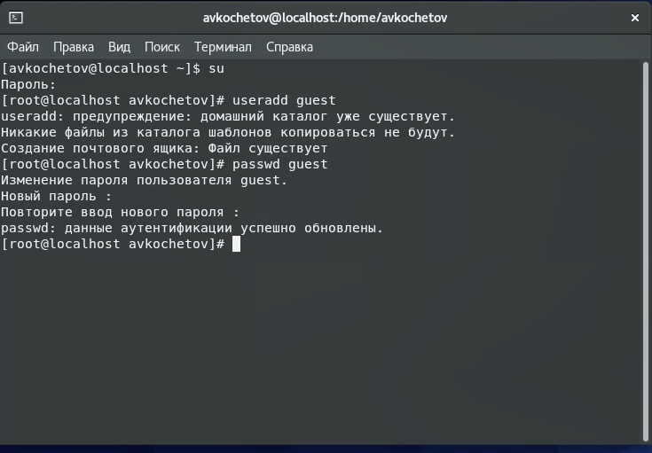
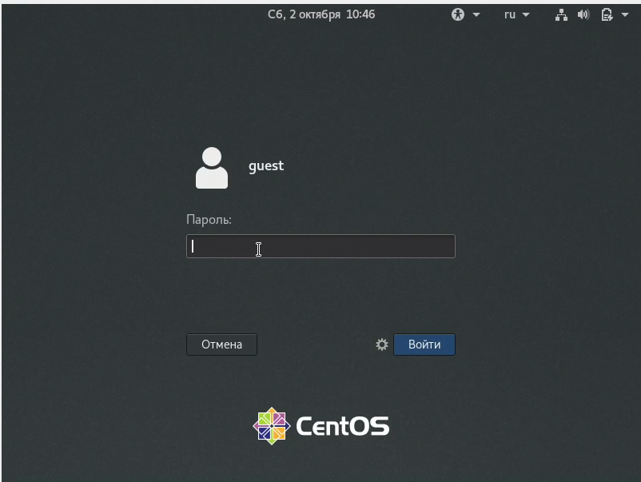
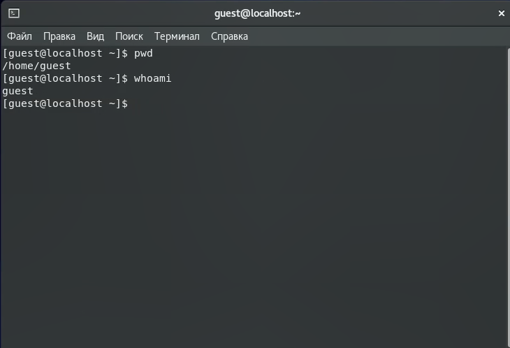
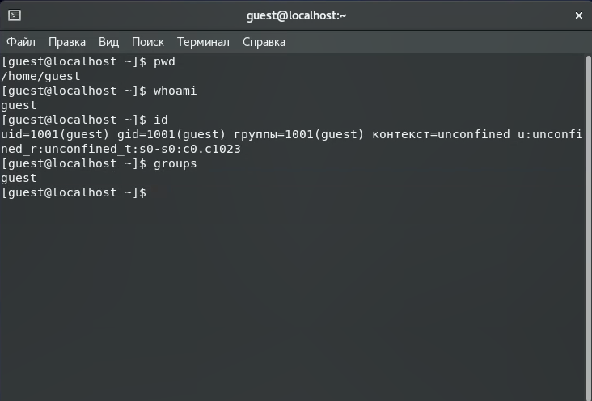
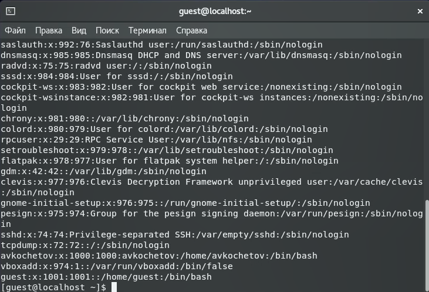
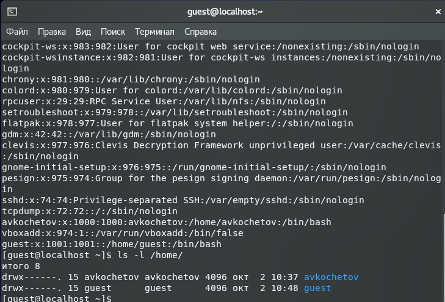
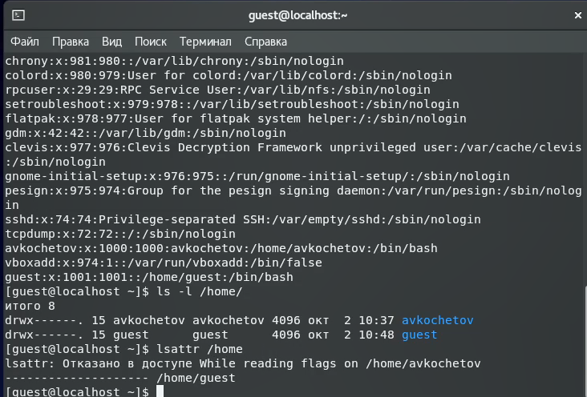
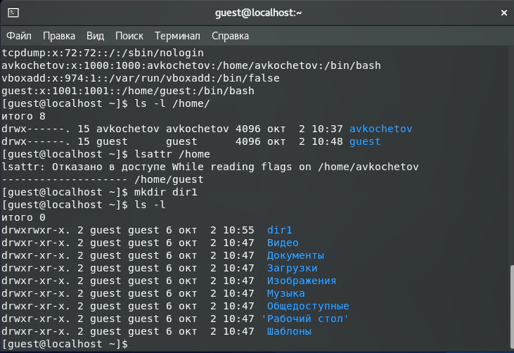
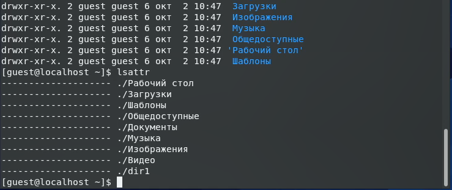
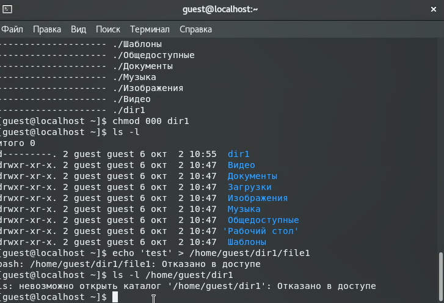

---
# Front matter
lang: ru-RU
title: 'Отчёт'
subtitle: 'по лабораторной работе 2'
author: 'Кочетов Андрей Владимирович'

# Formatting
toc-title: 'Содержание'
toc: true # Table of contents
toc_depth: 2
lof: true # List of figures
lot: true # List of tables
fontsize: 12pt
linestretch: 1.5
papersize: a4paper
documentclass: scrreprt
polyglossia-lang: russian
polyglossia-otherlangs: english
mainfont: LiberationSerif
romanfont: LiberationSerif
sansfont: LiberationSans
monofont: LiberationMono
mainfontoptions: Ligatures=TeX
romanfontoptions: Ligatures=TeX
sansfontoptions: Ligatures=TeX,Scale=MatchLowercase
monofontoptions: Scale=MatchLowercase
indent: true
pdf-engine: lualatex
header-includes:
  - \linepenalty=10 # the penalty added to the badness of each line within a paragraph (no associated penalty node) Increasing the value makes tex try to have fewer lines in the paragraph.
  - \interlinepenalty=0 # value of the penalty (node) added after each line of a paragraph.
  - \hyphenpenalty=50 # the penalty for line breaking at an automatically inserted hyphen
  - \exhyphenpenalty=50 # the penalty for line breaking at an explicit hyphen
  - \binoppenalty=700 # the penalty for breaking a line at a binary operator
  - \relpenalty=500 # the penalty for breaking a line at a relation
  - \clubpenalty=150 # extra penalty for breaking after first line of a paragraph
  - \widowpenalty=150 # extra penalty for breaking before last line of a paragraph
  - \displaywidowpenalty=50 # extra penalty for breaking before last line before a display math
  - \brokenpenalty=100 # extra penalty for page breaking after a hyphenated line
  - \predisplaypenalty=10000 # penalty for breaking before a display
  - \postdisplaypenalty=0 # penalty for breaking after a display
  - \floatingpenalty = 20000 # penalty for splitting an insertion (can only be split footnote in standard LaTeX)
  - \raggedbottom # or \flushbottom
  - \usepackage{float} # keep figures where there are in the text
  - \floatplacement{figure}{H} # keep figures where there are in the text
---

# Цель работы

Получение практических навыков работы в консоли с атрибутами файлов, закрепление теоретических основ дискреционного разграничения доступа в современных системах с открытым кодом на базе ОС Linux.

# Задание

Лабораторная работа подразумевает создание нового пользователя, работу с директориями, сравнение пользователей, настройку прав и заполение таблиц прав.

# Выполнение лабораторной работы

1. Создаю новую учетную запись guest и задаю к ней пароль(рис.1).

   { #fig:001 width=60% }

2. Захожу в систему под новым пользователем(рис.2).

   { #fig:002 width=60% }

3. Определил директорию при помощи команды pwd, убедился, что нахожусь в домашней директории и уточнил имя пользователя командой whoami(рис.3).

   { #fig:003 width=60% }

4. Уточнил имя пользователя, его группу, а также группы, куда входит пользователь, командой id и сравнил значения с командой groups(рис.4).
   Команда groups выводит те группы, в которых состоит наш пользователь. Сравнил. Можно сделать вывод, что эти команды выдают одинаковые значения.

   { #fig:004 width=60% }

5. Просмотрел файл /etc/passwd командой cat /etc/passwd(рис.5).
   Нашел свою учётную запись. Определил uid, gid пользователя. Сравните значения. Они совпадают.

   { #fig:005 width=60% }

6. Определил существующие в системе директории командой ls -l /home/(рис.6).
   Удалось определить существующие поддиректории директории /home.
   Флаг «d» говорит, что guest и avkochetov – это каталоги. Для обоих каталогов – полные права (rwx).

   { #fig:006 width=60% }

7. Проверил, какие расширенные атрибуты установлены на поддиректориях, находящихся в директории /home, командой lsattr /home(рис.7).
   Расширенные атрибуты других пользователей увидеть не удалось, так как недостаточно прав – отказано в доступе.

   { #fig:007 width=60% }

8. Создаю в домашней директории поддиректорию dir1 и определяю, какие права доступа и расширенные атрибуты были выставлены на директорию dir1 (рис.8-9).

   { #fig:008 width=60% }

   { #fig:009 width=60% }

9. Снимаю с директории dir1 все атрибуты командой chmod 000 dir1 и проверяю с её помощью правильность выполнения команды ls -l(рис.10).

   { #fig:010 width=60% }

10. Попытался создать в директории dir1 файл file1 и проверить действительно ли он не находится внутри директории dir1(рис.11).
    Увидел, что не могу производить никакие действия с dir1, потому что ранее снял все атрибуты.

   { #fig:011 width=60% }

11. Заполняю таблицу, выполняя действия от имени владельца директории, определив опытным путём, какие операции разрешены, а какие нет.
    Если операция разрешена, занесите в таблицу знак «+», если не разрешена, знак «-».
    
    Правка дир.|Права файла|Создание файла|Удаление файла|Запись в файл|Чтение файла|Смена дир.|Просмотр файлов в дир.|Переименование файла|Смена атр. файла|
    ---|---|---|---|---|---|---|---|---|---|
    d(000)|(000)|-|-|-|-|-|-|-|-|
    d(100)|(000)|-|-|-|-|+|-|-|+|
    d(200)|(000)|-|-|-|-|-|-|-|-|
    d(300)|(000)|+|+|-|-|+|-|+|+|
    d(400)|(000)|-|-|-|-|-|+|-|-|
    d(500)|(000)|-|-|-|-|+|+|-|+|
    d(600)|(000)|-|-|-|-|-|+|-|-|
    d(700)|(000)|+|+|-|-|+|+|+|+|
    d(000)|(100)|-|-|-|-|-|-|-|-|
    d(100)|(100)|-|-|-|-|+|-|-|+|
    d(200)|(100)|-|-|-|-|-|-|-|-|
    d(300)|(100)|+|+|-|-|+|-|+|+|
    d(400)|(100)|-|-|-|-|-|+|-|-|
    d(500)|(100)|-|-|-|-|+|+|-|+|
    d(600)|(100)|-|-|-|-|-|+|-|-|
    d(700)|(100)|+|+|-|-|+|+|+|+|
    d(000)|(200)|-|-|-|-|-|-|-|-|
    d(100)|(200)|-|-|-|-|+|-|-|+|
    d(200)|(200)|-|-|-|-|-|-|-|-|
    d(300)|(200)|+|+|-|-|+|-|+|+|
    d(400)|(200)|-|-|-|-|-|+|-|-|
    d(500)|(200)|-|-|-|-|+|+|-|+|
    d(600)|(200)|-|-|-|-|-|+|-|-|
    d(700)|(200)|+|+|-|-|+|+|+|+|
    d(000)|(300)|-|-|-|-|-|-|-|-|
    d(100)|(300)|-|-|-|-|+|-|-|+|
    d(200)|(300)|-|-|-|-|-|-|-|-|
    d(300)|(300)|+|+|-|-|+|-|+|+|
    d(400)|(300)|-|-|-|-|-|+|-|-|
    d(500)|(300)|-|-|-|-|+|+|-|+|
    d(600)|(300)|-|-|-|-|-|+|-|-|
    d(700)|(300)|+|+|-|-|+|+|+|+|
    d(000)|(400)|-|-|-|-|-|-|-|-|
    d(100)|(400)|-|-|-|+|+|-|-|+|
    d(200)|(400)|-|-|-|-|-|-|-|-|
    d(300)|(400)|+|+|-|+|+|-|+|+|
    d(400)|(400)|-|-|-|-|-|+|-|-|
    d(500)|(400)|-|-|-|+|+|+|-|+|
    d(600)|(400)|-|-|-|-|-|+|-|-|
    d(700)|(400)|+|+|-|+|+|+|+|+|
    d(000)|(500)|-|-|-|-|-|-|-|-|
    d(100)|(500)|-|-|-|+|+|-|-|+|
    d(200)|(500)|-|-|-|-|-|-|-|-|
    d(300)|(500)|+|+|-|+|+|-|+|+|
    d(400)|(500)|-|-|-|-|-|+|-|-|
    d(500)|(500)|-|-|-|+|+|+|-|+|
    d(600)|(500)|-|-|-|-|-|+|-|-|
    d(700)|(500)|+|+|-|+|+|+|+|+|
    d(000)|(600)|-|-|-|-|-|-|-|-|
    d(100)|(600)|-|-|-|+|+|-|-|+|
    d(200)|(600)|-|-|-|-|-|-|-|-|
    d(300)|(600)|+|+|-|+|+|-|+|+|
    d(400)|(600)|-|-|-|-|-|+|-|-|
    d(500)|(600)|-|-|-|+|+|+|-|+|
    d(600)|(600)|-|-|-|-|-|+|-|-|
    d(700)|(600)|+|+|-|+|+|+|+|+|
    d(000)|(700)|-|-|-|-|-|-|-|-|
    d(100)|(700)|-|-|-|+|+|-|-|+|
    d(200)|(700)|-|-|-|-|-|-|-|-|
    d(300)|(700)|+|+|+|+|+|-|+|+|
    d(400)|(700)|-|-|-|-|-|+|-|-|
    d(500)|(700)|-|-|-|+|+|+|-|+|
    d(600)|(700)|-|-|-|-|-|+|-|-|
    d(700)|(700)|+|+|+|+|+|+|+|+|

12. На основании заполненной таблицы определил те или иные минимально необходимые права для выполнения операций внутри директории dir1.
    
    Операция|Минимальные права на директорию|Минимальные права на файл|
    ---|---|---|
    Создание файла|300|000|
    Удаление файла|300|000|
    Чтение файла|100|400|
    Запись в файл|300|600|
    Переименование файла|300|000|
    Создание поддиректории|300|---|
    Удаление поддиректории|300|---|

# Выводы

Получил практические навыки работы в консоли с атрибутами файлов, закрепил теоретические основы дискреционного разграничения доступа в современных системах с открытым кодом на базе ОС Linux.