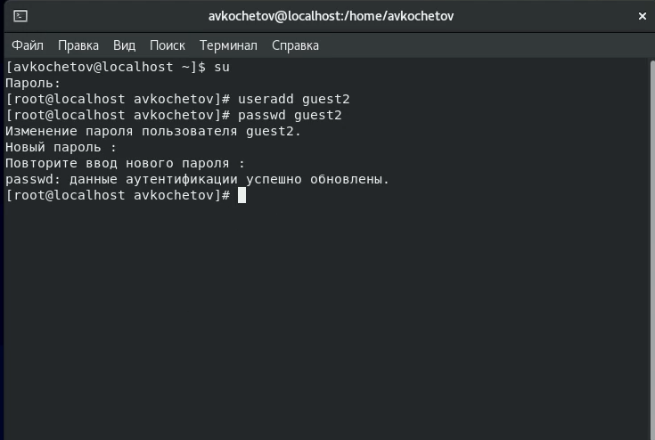
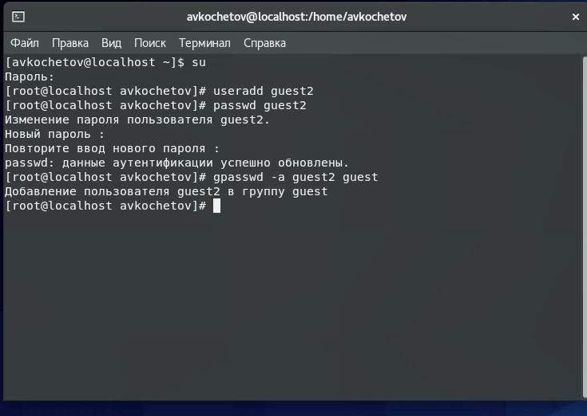
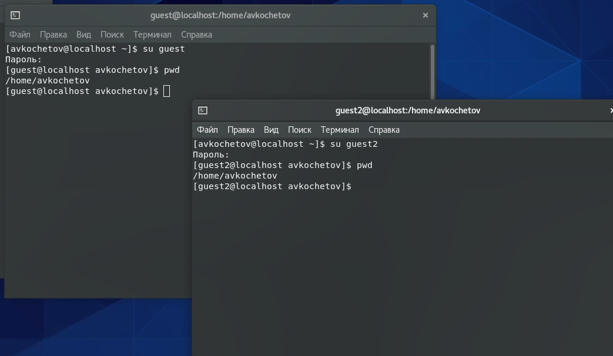
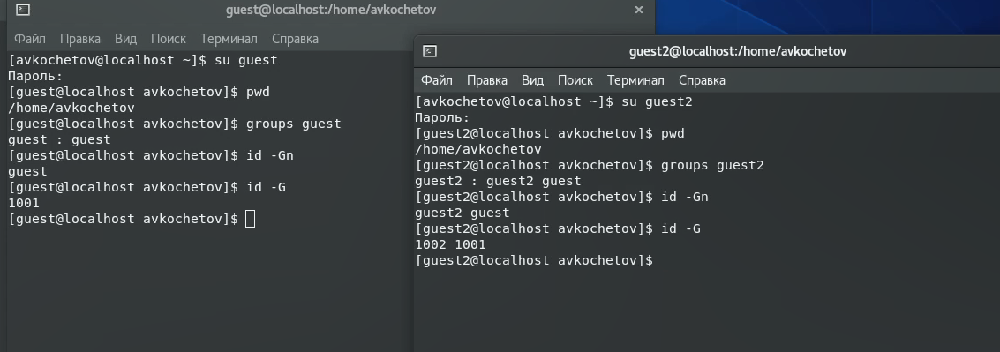
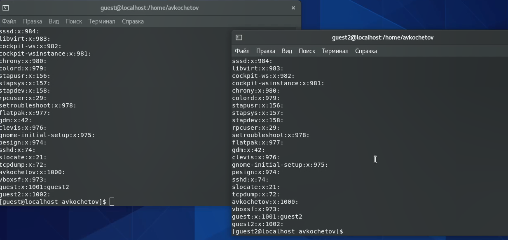
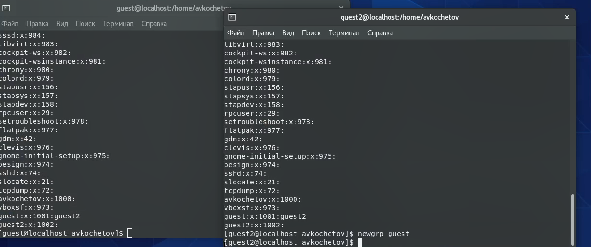
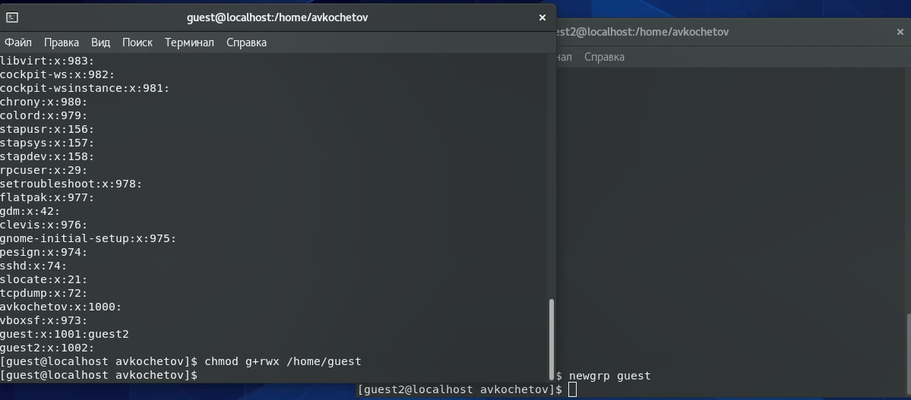
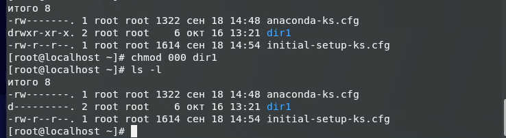

---
## Front matter
lang: ru-RU
title: Отчёт по лабораторной работе 3
author: 'Кочетов Андрей Владимирович'
date: 16 октября, 2021

## Formatting
toc: false
slide_level: 2
theme: metropolis
mainfont: PT Serif
romanfont: PT Serif
sansfont: PT Sans
monofont: PT Mono
header-includes: 
 - \metroset{progressbar=frametitle,sectionpage=progressbar,numbering=fraction}
 - '\makeatletter'
 - '\beamer@ignorenonframefalse'
 - '\makeatother'
aspectratio: 43
section-titles: true
---

## Цель работы

Получение практических навыков работы в консоли с атрибутами файлов для групп пользователей.

## Задание

Лабораторная работа подразумевает создание нового пользователя, работу с директориями, сравнение пользователей, настройку прав и заполение таблиц прав.

# Выполнение лабораторной работы

1. Пользователь guest создан в рамках предыдущей лаб. работы, поэтому я создаю пользователя guest2 и задаю пароль(рис.1).

   { #fig:001 width=60% }

---

2. Добавляю пользователя guest2 в группу guest(рис.2).

   { #fig:002 width=60% }

---

3. Выполняю вход в систему от двух пользователей в консолях и для обоих определяю директорию. Оба находятся в домашней директории avkochetov(рис.3).

   { #fig:003 width=60% }

---

4. Уточняю имя пользователя, его группу, а также группы, куда входит пользователь и использовал команды id -Gn и id -G(рис.4).
   Команда groups выводит те группы, в которых состоит наш пользователь. Guest состоит в guest, а guest2 состоит в guest и guest2.
   Аналогичные выводы получил от команды id, только с уточнением, что id групп 1002 и 1001 соотвестенно.

   { #fig:004 width=60% }

---

5. Просмотрел файл /etc/group командой cat /etc/group(рис.5).
   Нашел свои учётные записи. Определил uid, gid пользователя. Сравнил значения. Они совпадают.

   { #fig:005 width=60% }

---

6. От имени пользователя guest2 выполнил регистрацию пользователя в группе guest(рис.6).

   { #fig:006 width=60% }

---

7. От имени пользователя guest изменил права директории home/guest, разрешив все действия(рис.7).

   { #fig:007 width=60% }

---

8. Снял с директории home/guest/dir1 все атрибуты командой chmod(рис.8).

   { #fig:008 width=60% }

---

9. Заполняю таблицу, выполняя действия от имени пользователя guest и делая проверку от guest2.
    Определяю опытным путём, какие операции разрешены, а какие нет.
    Если операция разрешена, занесите в таблицу знак «+», если не разрешена, знак «-».
    Сравниваю таблицу с таблицей из предыдущей лаб. работы.

    На основании заполненной таблицы определил те или иные минимально необходимые права для выполнения пользователем guest2 операций внутри директории dir1.

# Выводы

Получил практические навыки работы в консоли с атрибутами файлов для групп пользователей.

## {.standout}

Спасибо за внимание
