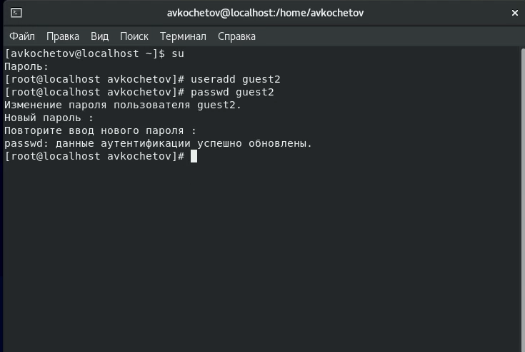
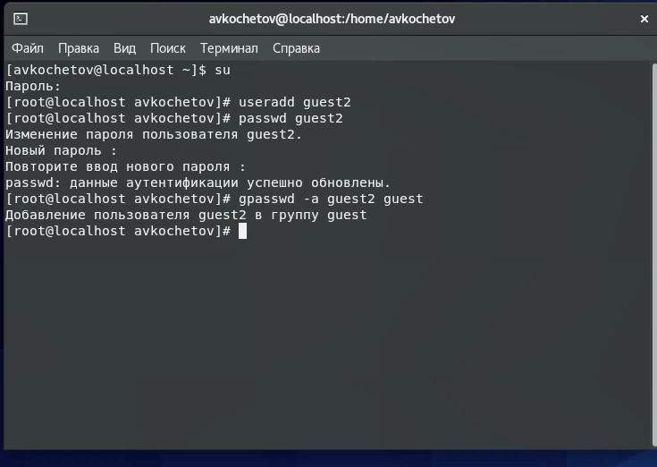
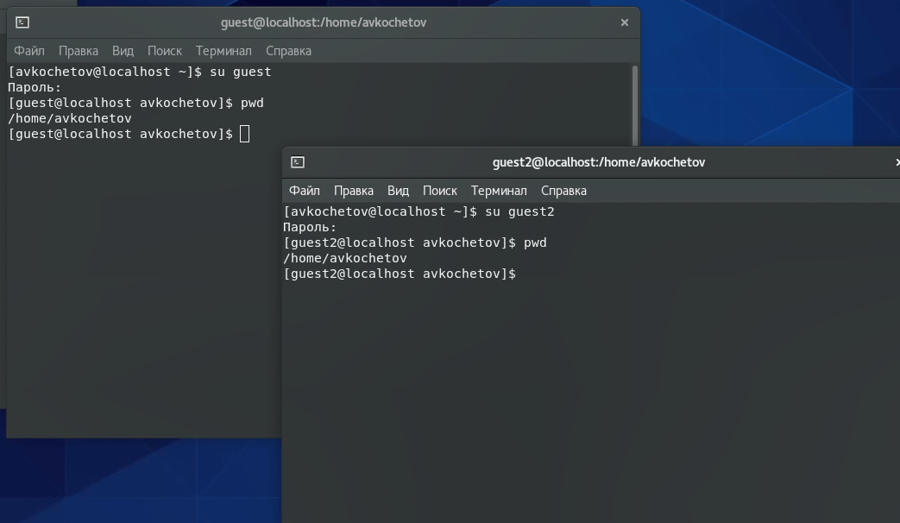
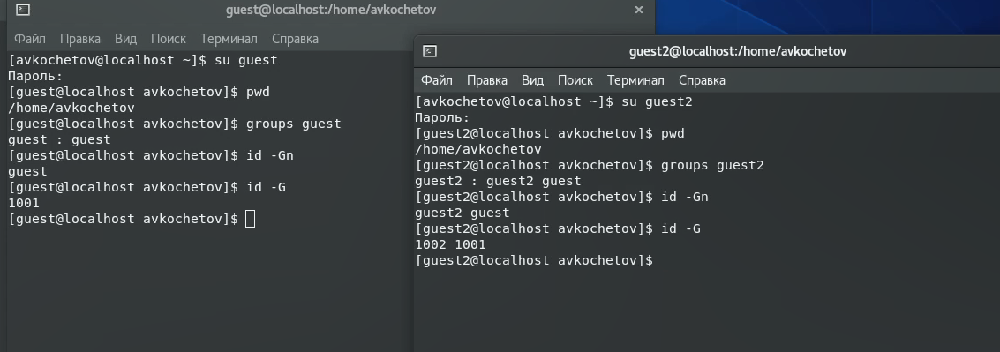
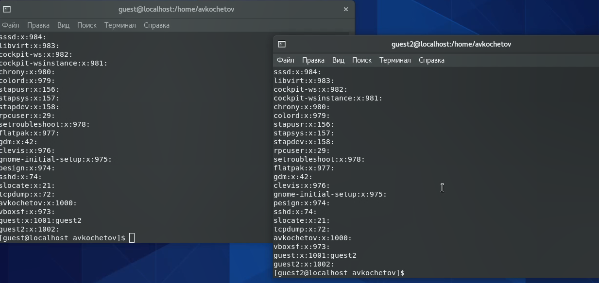
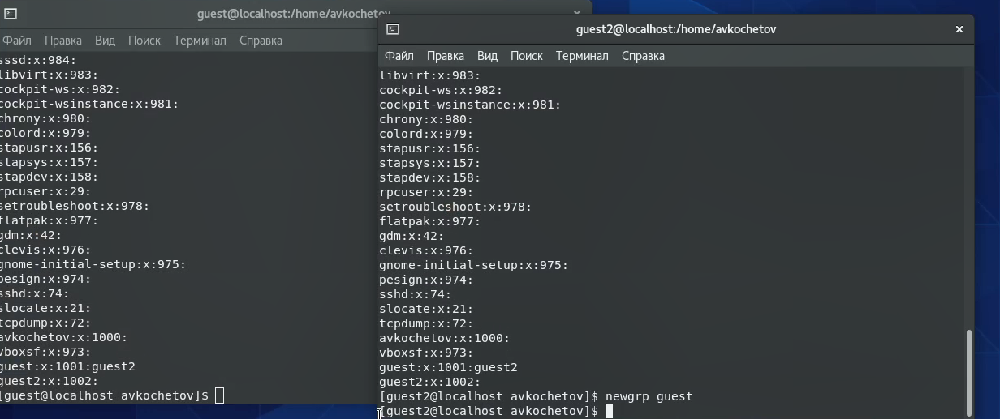
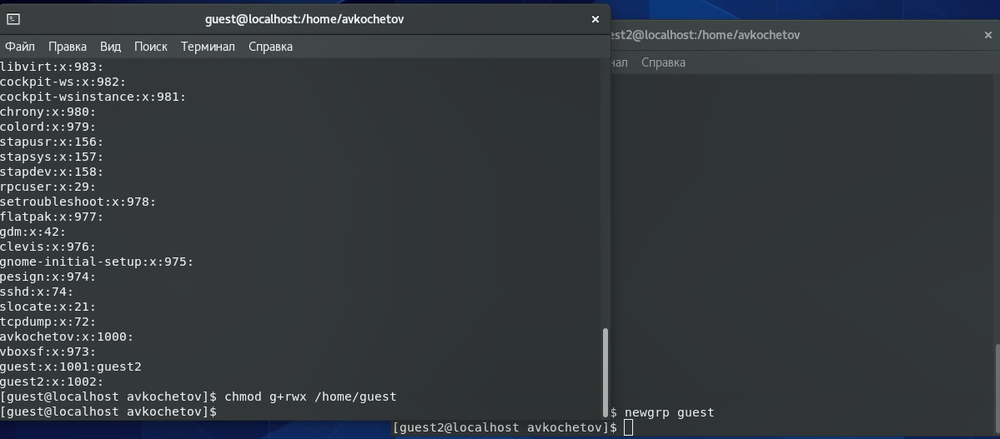
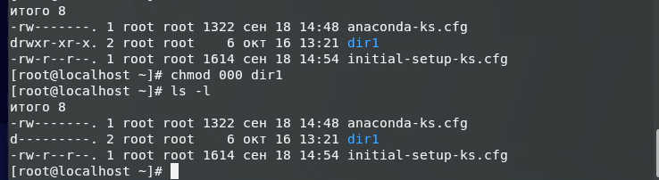

---
# Front matter
lang: ru-RU
title: 'Отчёт'
subtitle: 'по лабораторной работе 3'
author: 'Кочетов Андрей Владимирович'

# Formatting
toc-title: 'Содержание'
toc: true # Table of contents
toc_depth: 2
lof: true # List of figures
lot: true # List of tables
fontsize: 12pt
linestretch: 1.5
papersize: a4paper
documentclass: scrreprt
polyglossia-lang: russian
polyglossia-otherlangs: english
mainfont: LiberationSerif
romanfont: LiberationSerif
sansfont: LiberationSans
monofont: LiberationMono
mainfontoptions: Ligatures=TeX
romanfontoptions: Ligatures=TeX
sansfontoptions: Ligatures=TeX,Scale=MatchLowercase
monofontoptions: Scale=MatchLowercase
indent: true
pdf-engine: lualatex
header-includes:
  - \linepenalty=10 # the penalty added to the badness of each line within a paragraph (no associated penalty node) Increasing the value makes tex try to have fewer lines in the paragraph.
  - \interlinepenalty=0 # value of the penalty (node) added after each line of a paragraph.
  - \hyphenpenalty=50 # the penalty for line breaking at an automatically inserted hyphen
  - \exhyphenpenalty=50 # the penalty for line breaking at an explicit hyphen
  - \binoppenalty=700 # the penalty for breaking a line at a binary operator
  - \relpenalty=500 # the penalty for breaking a line at a relation
  - \clubpenalty=150 # extra penalty for breaking after first line of a paragraph
  - \widowpenalty=150 # extra penalty for breaking before last line of a paragraph
  - \displaywidowpenalty=50 # extra penalty for breaking before last line before a display math
  - \brokenpenalty=100 # extra penalty for page breaking after a hyphenated line
  - \predisplaypenalty=10000 # penalty for breaking before a display
  - \postdisplaypenalty=0 # penalty for breaking after a display
  - \floatingpenalty = 20000 # penalty for splitting an insertion (can only be split footnote in standard LaTeX)
  - \raggedbottom # or \flushbottom
  - \usepackage{float} # keep figures where there are in the text
  - \floatplacement{figure}{H} # keep figures where there are in the text
---

# Цель работы

Получение практических навыков работы в консоли с атрибутами файлов для групп пользователей.

# Задание

Лабораторная работа подразумевает создание нового пользователя, работу с директориями, сравнение пользователей, настройку прав и заполение таблиц прав.

# Выполнение лабораторной работы

1. Пользователь guest создан в рамках предыдущей лаб. работы, поэтому я создаю пользователя guest2 и задаю пароль(рис.1).

   { #fig:001 width=60% }

2. Добавляю пользователя guest2 в группу guest(рис.2).

   { #fig:002 width=60% }

3. Выполняю вход в систему от двух пользователей в консолях и для обоих определяю директорию. Оба находятся в домашней директории avkochetov(рис.3).

   { #fig:003 width=60% }

4. Уточняю имя пользователя, его группу, а также группы, куда входит пользователь и использовал команды id -Gn и id -G(рис.4).
   Команда groups выводит те группы, в которых состоит наш пользователь. Guest состоит в guest, а guest2 состоит в guest и guest2.
   Аналогичные выводы получил от команды id, только с уточнением, что id групп 1002 и 1001 соотвестенно.

   { #fig:004 width=60% }

5. Просмотрел файл /etc/group командой cat /etc/group(рис.5).
   Нашел свои учётные записи. Определил uid, gid пользователя. Сравнил значения. Они совпадают.

   { #fig:005 width=60% }

6. От имени пользователя guest2 выполнил регистрацию пользователя в группе guest(рис.6).

   { #fig:006 width=60% }

7. От имени пользователя guest изменил права директории home/guest, разрешив все действия(рис.7).

   { #fig:007 width=60% }

8. Снял с директории home/guest/dir1 все атрибуты командой chmod(рис.8).

   { #fig:008 width=60% }

9. Заполняю таблицу, выполняя действия от имени пользователя guest и делая проверку от guest2.
    Определяю опытным путём, какие операции разрешены, а какие нет.
    Если операция разрешена, занесите в таблицу знак «+», если не разрешена, знак «-».
    Сравниваю таблицу с таблицей из предыдущей лаб. работы.
    
    Правка дир.|Права файла|Создание файла|Удаление файла|Запись в файл|Чтение файла|Смена дир.|Просмотр файлов в дир.|Переименование файла|Смена атр. файла|
    ---|---|---|---|---|---|---|---|---|---|
    d---------(000)|----------(000)|-|-|-|-|-|-|-|-|
    d-----x---(010)|----------(000)|-|-|-|-|+|-|-|+|
    d----w----(020)|----------(000)|-|-|-|-|-|-|-|-|
    d----wx---(030)|----------(000)|+|+|-|-|+|-|+|+|
    d---r-----(040)|----------(000)|-|-|-|-|-|+|-|-|
    d---r-x---(050)|----------(000)|-|-|-|-|+|+|-|+|
    d---rw----(060)|----------(000)|-|-|-|-|-|+|-|-|
    d---rwx---(070)|----------(000)|+|+|-|-|+|+|+|+|
    d---------(000)|------x---(010)|-|-|-|-|-|-|-|-|
    d-----x---(010)|------x---(010)|-|-|-|-|+|-|-|+|
    d----w----(020)|------x---(010)|-|-|-|-|-|-|-|-|
    d----wx---(030)|------x---(010)|+|+|-|-|+|-|+|+|
    d---r-----(040)|------x---(010)|-|-|-|-|-|+|-|-|
    d---r-x---(050)|------x---(010)|-|-|-|-|+|+|-|+|
    d---rw----(060)|------x---(010)|-|-|-|-|-|+|-|-|
    d---rwx---(070)|------x---(010)|+|+|-|-|+|+|+|+|
    d---------(000)|-----w----(020)|-|-|-|-|-|-|-|-|
    d-----x---(010)|-----w----(020)|-|-|+|-|+|-|-|+|
    d----w----(020)|-----w----(020)|-|-|-|-|-|-|-|-|
    d----wx---(030)|-----w----(020)|+|+|+|-|+|-|+|+|
    d---r-----(040)|-----w----(020)|-|-|-|-|-|+|-|-|
    d---r-x---(050)|-----w----(020)|-|-|+|-|+|+|-|+|
    d---rw----(060)|-----w----(020)|-|-|-|-|-|+|-|-|
    d---rwx---(070)|-----w----(020)|+|+|+|-|+|+|+|+|
    d---------(000)|-----wx---(030)|-|-|-|-|-|-|-|-|
    d-----x---(010)|-----wx---(030)|-|-|+|-|+|-|-|+|
    d----w----(020)|-----wx---(030)|-|-|-|-|-|-|-|-|
    d----wx---(030)|-----wx---(030)|+|+|+|-|+|-|+|+|
    d---r-----(040)|-----wx---(030)|-|-|-|-|-|+|-|-|
    d---r-x---(050)|-----wx---(030)|-|-|+|-|+|+|-|+|
    d---rw----(060)|-----wx---(030)|-|-|-|-|-|+|-|-|
    d---rwx---(070)|-----wx---(030)|+|+|+|-|+|+|+|+|
    d---------(000)|----r-----(040)|-|-|-|-|-|-|-|-|
    d-----x---(010)|----r-----(040)|-|-|-|+|+|-|-|+|
    d----w----(020)|----r-----(040)|-|-|-|-|-|-|-|-|
    d----wx---(030)|----r-----(040)|+|+|-|+|+|-|+|+|
    d---r-----(040)|----r-----(040)|-|-|-|-|-|+|-|-|
    d---r-x---(050)|----r-----(040)|-|-|-|+|+|+|-|+|
    d---rw----(060)|----r-----(040)|-|-|-|-|-|+|-|-|
    d---rwx---(070)|----r-----(040)|+|+|-|+|+|+|+|+|
    d---------(000)|----r-x---(050)|-|-|-|-|-|-|-|-|
    d-----x---(010)|----r-x---(050)|-|-|-|+|+|-|-|+|
    d----w----(020)|----r-x---(050)|-|-|-|-|-|-|-|-|
    d----wx---(030)|----r-x---(050)|+|+|-|+|+|-|+|+|
    d---r-----(040)|----r-x---(050)|-|-|-|-|-|+|-|-|
    d---r-x---(050)|----r-x---(050)|-|-|-|+|+|+|-|+|
    d---rw----(060)|----r-x---(050)|-|-|-|-|-|+|-|-|
    d---rwx---(070)|----r-x---(050)|+|+|-|+|+|+|+|+|
    d---------(000)|----rw----(060)|-|-|-|-|-|-|-|-|
    d-----x---(010)|----rw----(060)|-|-|+|+|+|-|-|+|
    d----w----(020)|----rw----(060)|-|-|-|-|-|-|-|-|
    d----wx---(030)|----rw----(060)|+|+|+|+|+|-|+|+|
    d---r-----(040)|----rw----(060)|-|-|-|-|-|+|-|-|
    d---r-x---(050)|----rw----(060)|-|-|+|+|+|+|-|+|
    d---rw----(060)|----rw----(060)|-|-|-|-|-|+|-|-|
    d---rwx---(070)|----rw----(060)|+|+|+|+|+|+|+|+|
    d---------(000)|----rwx---(070)|-|-|-|-|-|-|-|-|
    d-----x---(100)|----rwx---(070)|-|-|+|+|+|-|-|+|
    d----w----(200)|----rwx---(070)|-|-|-|-|-|-|-|-|
    d----wx---(300)|----rwx---(070)|+|+|+|+|+|-|+|+|
    d---r-----(400)|----rwx---(070)|-|-|-|-|-|+|-|-|
    d---r-x---(500)|----rwx---(070)|-|-|+|+|+|+|-|+|
    d---rw----(600)|----rwx---(070)|-|-|-|-|-|+|-|-|
    d---rwx---(700)|----rwx---(070)|+|+|+|+|+|+|+|+|

10. На основании заполненной таблицы определил те или иные минимально необходимые права для выполнения пользователем guest2 операций внутри директории dir1.
    
    Операция|Минимальные права на директорию|Минимальные права на файл|
    ---|---|---|
    Создание файла|d----wx---(030)|----------(000)|
    Удаление файла|d----wx---(030)|----------(000)|
    Чтение файла|d-----x---(010)|----r----(040)|
    Запись в файл|d-----x---(010)|-----w---(020)|
    Переименование файла|d----wx---(030)|----------(000)|
    Создание поддиректории|d----wx---(030)|----------(000)|
    Удаление поддиректории|d----wx---(030)|----------(000)|

# Выводы

Получил практические навыки работы в консоли с атрибутами файлов для групп пользователей.