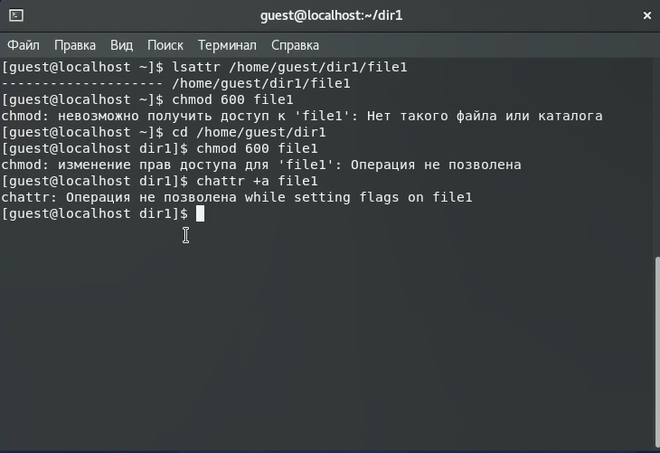
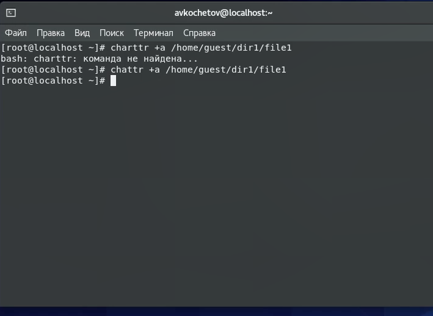
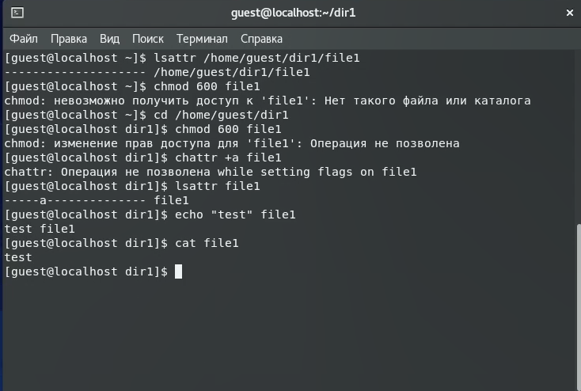
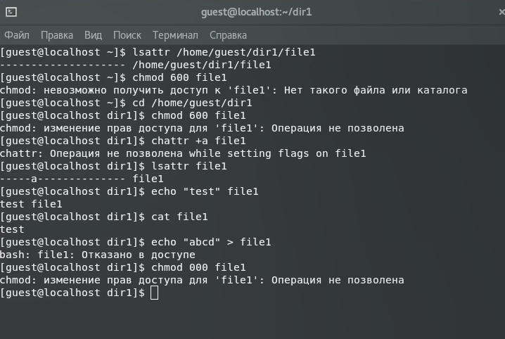
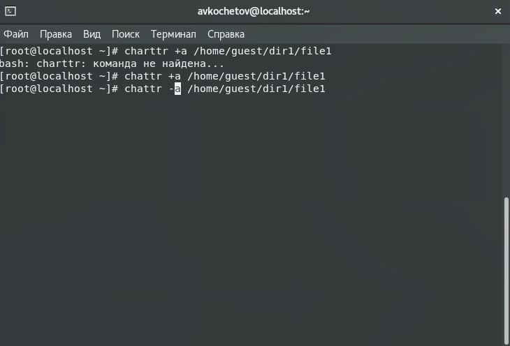
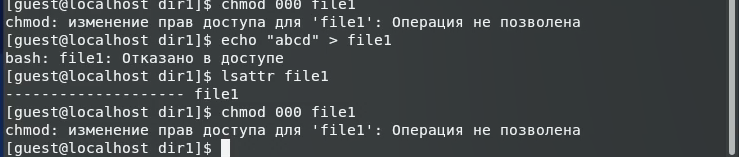
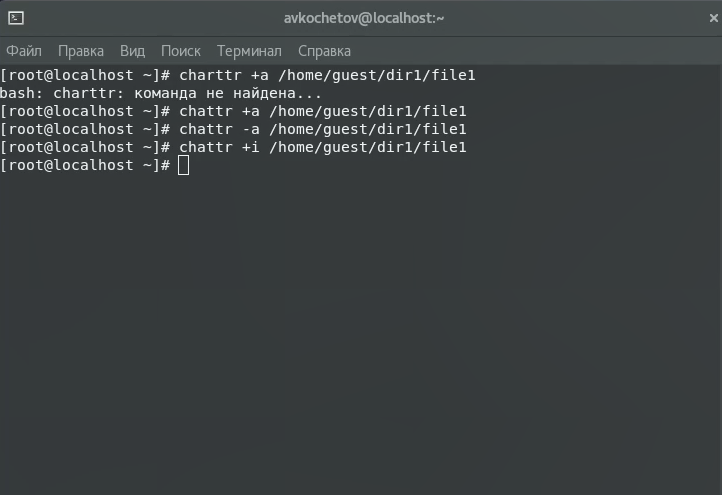
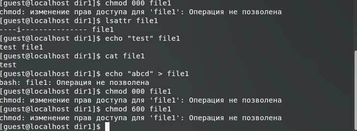

---
## Front matter
lang: ru-RU
title: Отчёт по лабораторной работе 4
author: 'Кочетов Андрей Владимирович'
date: 30 октября, 2021

## Formatting
toc: false
slide_level: 2
theme: metropolis
mainfont: PT Serif
romanfont: PT Serif
sansfont: PT Sans
monofont: PT Mono
header-includes: 
 - \metroset{progressbar=frametitle,sectionpage=progressbar,numbering=fraction}
 - '\makeatletter'
 - '\beamer@ignorenonframefalse'
 - '\makeatother'
aspectratio: 43
section-titles: true
---

## Цель работы

Получение практических навыков работы в консоли с расширенными атрибутами файлов.

## Задание

Лабораторная работа подразумневает последовательное выполнение команд, используя разные расширенные атрибуты.

# Выполнение лабораторной работы

1. Определил расш. атрибуты файла, попытался изменить права и установить расщ. атрибут a. Везде получил отказ(рис.1).

   { #fig:001 width=60% }

---

2. Зашел в root пользователя и успешно установил расш. атрибут на файл(рис.2).

   { #fig:002 width=60% }

---

3. Проверил правильно добавления атрибута, выполнил дозапись слова test в файл и прочитал. Все было успешно(рис.3).

   { #fig:003 width=60% }

---

4. Попытался стереть информацию в файле и установить права на него. Выполнить команды не удалось(рис.4).

   { #fig:004 width=60% }

---

5. Снял расширенный атрибут a через root пользователя(рис.5).

   { #fig:005 width=60% }

---

6. Попытался снова выполнить команды, при выполнении которых было отказано в доступе(рис.6).

   { #fig:006 width=60% }

---

7. Установил расширенный атрибут i через root пользователя(рис.7).

   { #fig:007 width=60% }

---

8. Повторил все команды, после чего обнаружил, что большинство команд выполнить так и не удалось(рис.8).

   { #fig:008 width=60% }

# Выводы

Получил практические навыки работы в консоли с атрибутами файлов для групп пользователей.

## {.standout}

Спасибо за внимание
