---
# Front matter
lang: ru-RU
title: 'Отчёт'
subtitle: 'по лабораторной работе 5'
author: 'Кочетов Андрей Владимирович'

# Formatting
toc-title: 'Содержание'
toc: true # Table of contents
toc_depth: 2
lof: true # List of figures
lot: true # List of tables
fontsize: 12pt
linestretch: 1.5
papersize: a4paper
documentclass: scrreprt
polyglossia-lang: russian
polyglossia-otherlangs: english
mainfont: LiberationSerif
romanfont: LiberationSerif
sansfont: LiberationSans
monofont: LiberationMono
mainfontoptions: Ligatures=TeX
romanfontoptions: Ligatures=TeX
sansfontoptions: Ligatures=TeX,Scale=MatchLowercase
monofontoptions: Scale=MatchLowercase
indent: true
pdf-engine: lualatex
header-includes:
  - \linepenalty=10 # the penalty added to the badness of each line within a paragraph (no associated penalty node) Increasing the value makes tex try to have fewer lines in the paragraph.
  - \interlinepenalty=0 # value of the penalty (node) added after each line of a paragraph.
  - \hyphenpenalty=50 # the penalty for line breaking at an automatically inserted hyphen
  - \exhyphenpenalty=50 # the penalty for line breaking at an explicit hyphen
  - \binoppenalty=700 # the penalty for breaking a line at a binary operator
  - \relpenalty=500 # the penalty for breaking a line at a relation
  - \clubpenalty=150 # extra penalty for breaking after first line of a paragraph
  - \widowpenalty=150 # extra penalty for breaking before last line of a paragraph
  - \displaywidowpenalty=50 # extra penalty for breaking before last line before a display math
  - \brokenpenalty=100 # extra penalty for page breaking after a hyphenated line
  - \predisplaypenalty=10000 # penalty for breaking before a display
  - \postdisplaypenalty=0 # penalty for breaking after a display
  - \floatingpenalty = 20000 # penalty for splitting an insertion (can only be split footnote in standard LaTeX)
  - \raggedbottom # or \flushbottom
  - \usepackage{float} # keep figures where there are in the text
  - \floatplacement{figure}{H} # keep figures where there are in the text
---

# Цель работы

Изучение механизмов изменения идентификаторов, применения SetUID- и Sticky-битов. Получение практических навыков работы в консоли с дополнительными атрибутами. Рассмотрение работы механизма смены идентификатора процессов пользователей, а также влияние бита Sticky на запись и удаление файлов.

# Задание

Улучшить навыки работы с консолью и атрибутами. Научиться писать программы и работать с ними.

# Выполнение лабораторной работы

1. Убедился, что программа установлена и выключил систему запретов(рис.1).

   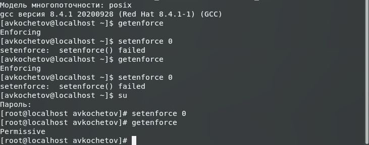{ #fig:001 width=60% }

2. Вошел в систему от guest и создал программу simpleid.c(рис.2-3).

   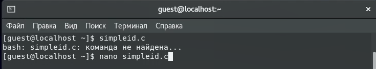{ #fig:002 width=60% }

   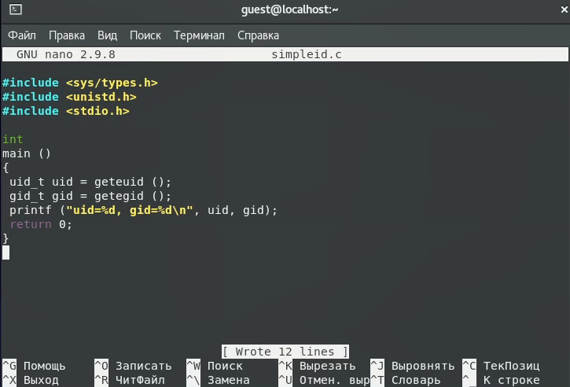{ #fig:003 width=60% }

3. Скомпилировал программу, выполнил ее и выполнил системную программу id. Сравнил полученные результаты(рис.4).

   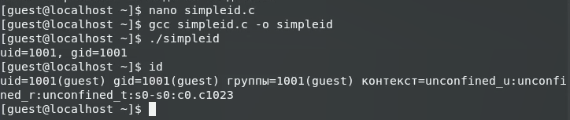{ #fig:004 width=60% }

4. Усложнил программу и дал ей новое название(рис.5).

   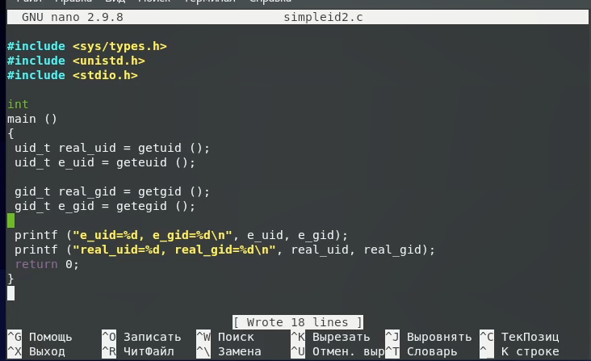{ #fig:005 width=60% }

5. Скомпилировал и запустил новую программу(рис.6).

   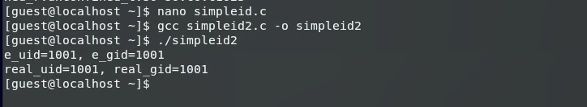{ #fig:006 width=60% }

6. От root выполнил определенные команды, проверил проверку новых атрибутов и запустил программу. Сравнил результаты(рис.7).

   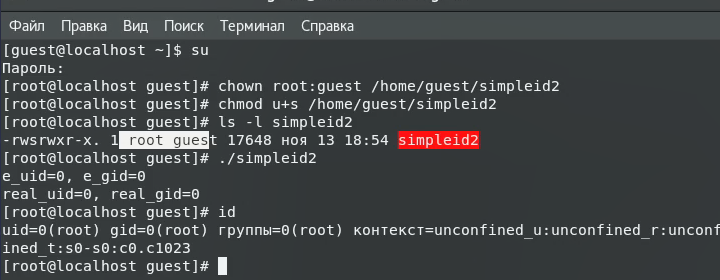{ #fig:007 width=60% }

7. Проделал тоже самое относительно SetGID-бита(рис.8).

   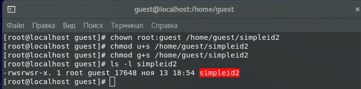{ #fig:008 width=60% }

8. Создал еще одну программу с названием readfile.c и откомпилировал ее(рис.9-10).

   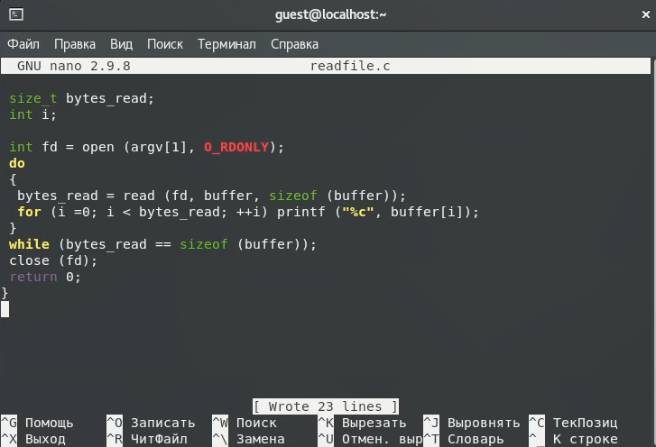{ #fig:009 width=60% }

   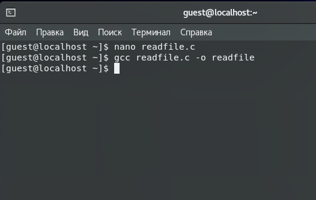{ #fig:010 width=60% }

9. Сменил владельца у файла и изменил права. Убедился, что смена прошла успешно(рис.11).

   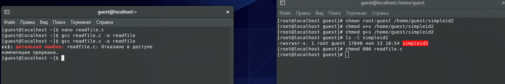{ #fig:011 width=60% }

10. Сменил владельца и поставил SetU'D-бит. Таким образом смог прочитать файл и прочитать shadow(рис.12-13).

   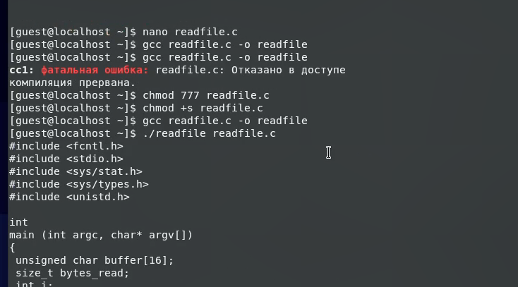{ #fig:012 width=60% }

   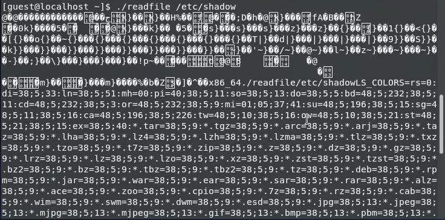{ #fig:013 width=60% }

11. Проверил атрибут Sticky, создал файл file01.txt со словом, посмотрел атрибуты и разрешил запись для всех остальных пользователей(рис.14).

   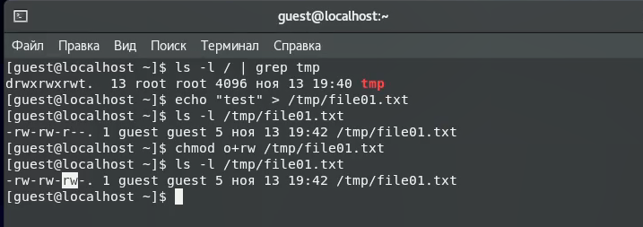{ #fig:014 width=60% }

12. Выполнил ряд команд от пользователя Guest2. Не удалось выполнить команду rm(рис.15).

   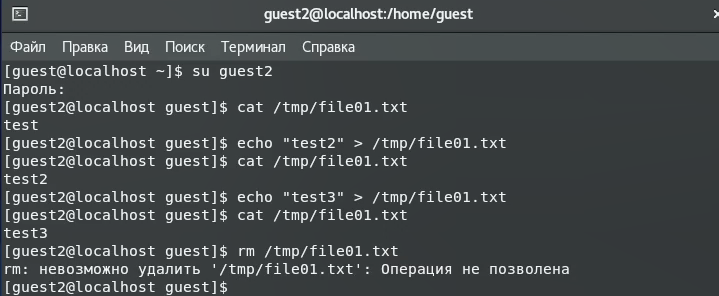{ #fig:015 width=60% }

13. Снял атрибут t, проверил, что атрибут снят, и успешно выполнил программу rm(рис.16).

   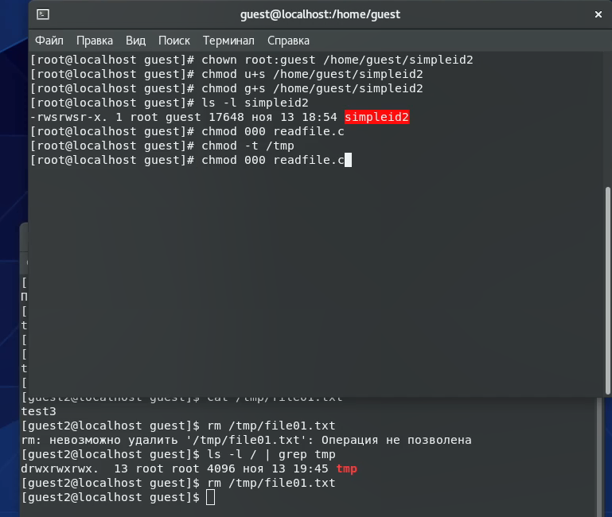{ #fig:016 width=60% }

14. Вернул атрибут t(рис.17).

   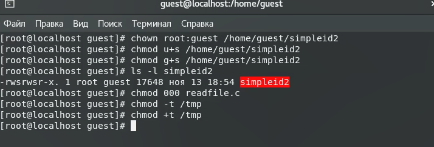{ #fig:017 width=60% }

# Выводы

Изученил механизмы изменения идентификаторов, применения SetUID- и Sticky-битов. Полученил практические навыки работы в консоли с дополнительными атрибутами. Рассмотрел работы механизма смены идентификатора процессов пользователей, а также влияние бита Sticky на запись и удаление файлов.