---
## Front matter
lang: ru-RU
title: Отчёт по лабораторной работе 6
author: 'Кочетов Андрей Владимирович'
date: 27 ноября, 2021

## Formatting
toc: false
slide_level: 2
theme: metropolis
mainfont: PT Serif
romanfont: PT Serif
sansfont: PT Sans
monofont: PT Mono
header-includes: 
 - \metroset{progressbar=frametitle,sectionpage=progressbar,numbering=fraction}
 - '\makeatletter'
 - '\beamer@ignorenonframefalse'
 - '\makeatother'
aspectratio: 43
section-titles: true
---

## Цель работы

Развить навыки администрирования ОС Linux. Получить первое практическое знакомство с технологией SELinux1.
Проверить работу SELinx на практике совместно с веб-сервером Apache.

## Задание

Работа с сервером apach и настройка портов.

# Выполнение лабораторной работы

1. Проверил режим работы SElinux при помощи 2 команд(рис.1).

   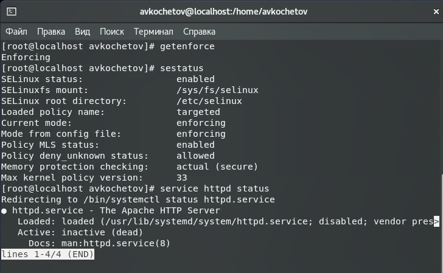{ #fig:001 width=60% }

---

2. Запустил сервер и проверил его рабоспособность(рис.2).

   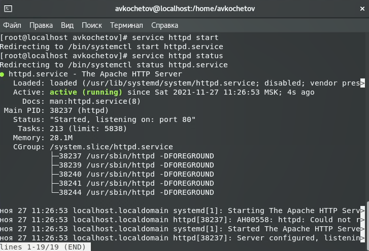{ #fig:002 width=60% }

---

3. Нашел веб-сервер Apache в списке процессов(рис.3).

   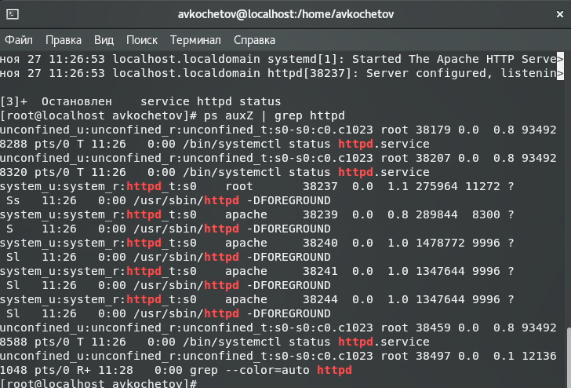{ #fig:003 width=60% }

---

4. Посмотрел текущее состояние переключателей SELinux для Apache(рис.4).

   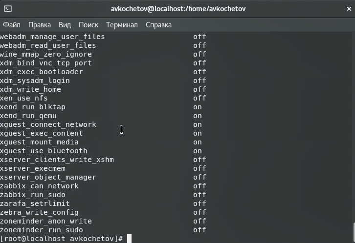{ #fig:004 width=60% }

---

5. Посмотрел статистику по политике, тип файлов и поддиректорий и тип файлов, находящихся в другой директории(рис.5).

   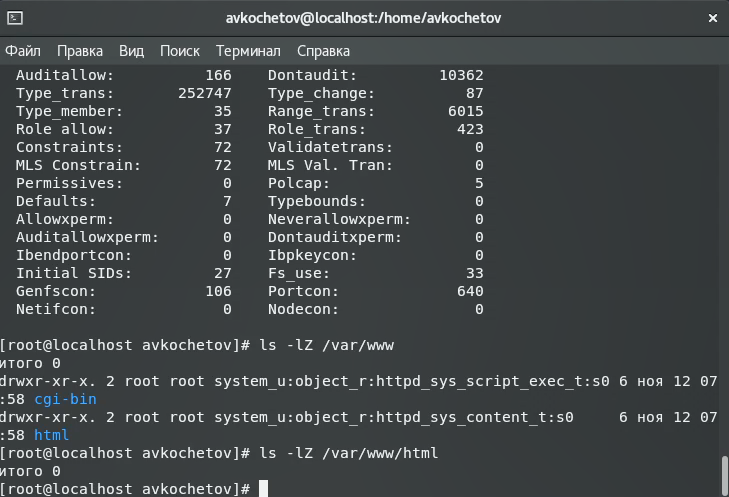{ #fig:005 width=60% }

---

6. Создал html-файл, проверил контекст файла(рис.6).

   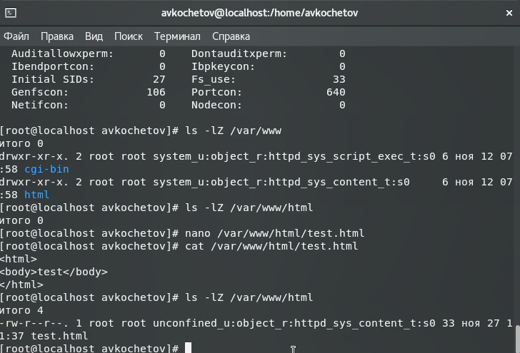{ #fig:006 width=60% }

---

7. Обратился к файлу через веб-сервер(рис.7).

   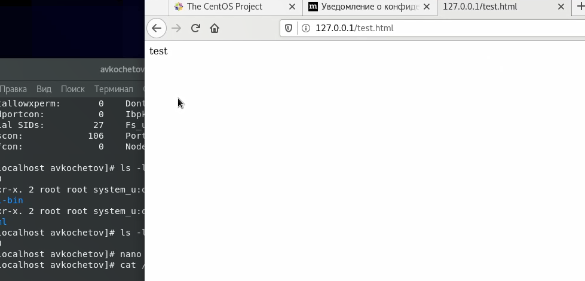{ #fig:007 width=60% }

---

8. Проверил контекст командой ls -Z, изменил контекст на другой, убедился в смене и проверил работоспособность веб-сервера (рис.8).

   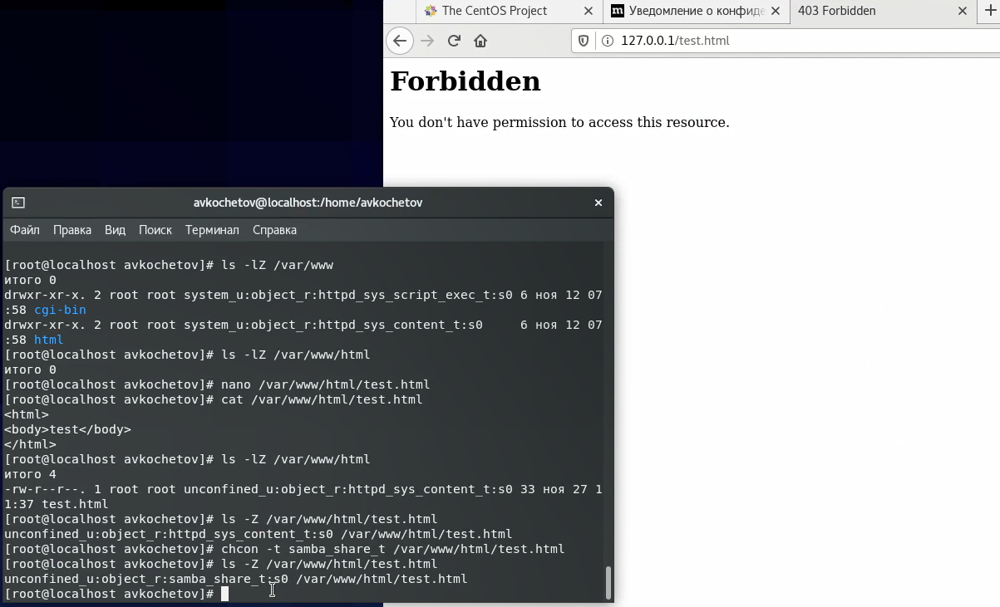{ #fig:008 width=60% }

---

9. Проанализировал ситуацию и посмотрел логи(рис.9).

   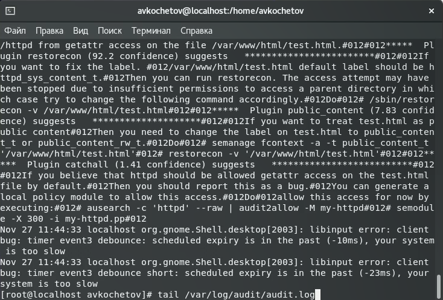{ #fig:009 width=60% }

---

10. Сменил порт на ТСР-порт 81(рис.10).

   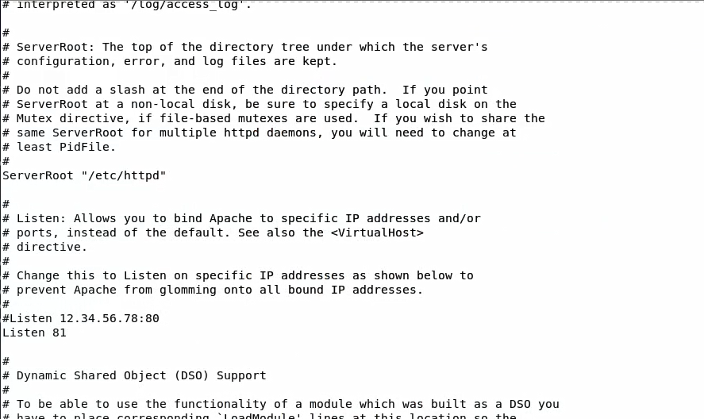{ #fig:010 width=60% }

---

11. Выполнил перезапуск сервера и увидел сбой(рис.11).

   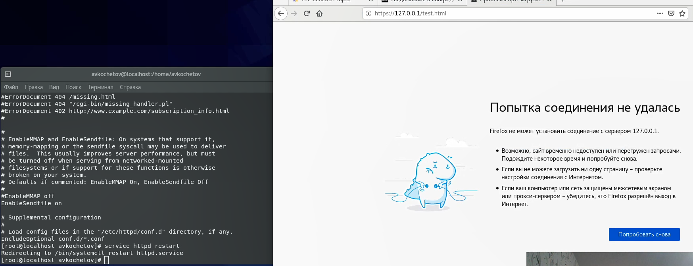{ #fig:011 width=60% }

---

12. Проанализировал log-файлы(рис.12).

   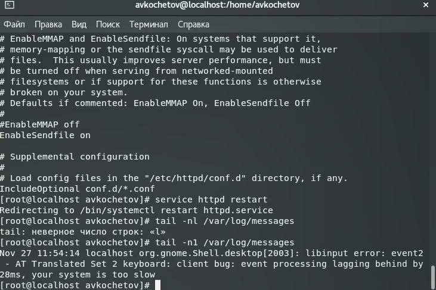{ #fig:012 width=60% }

---

13. Выполнил программу semanage и проверил список портов, где увидел порт 81 в списке(рис.13).

   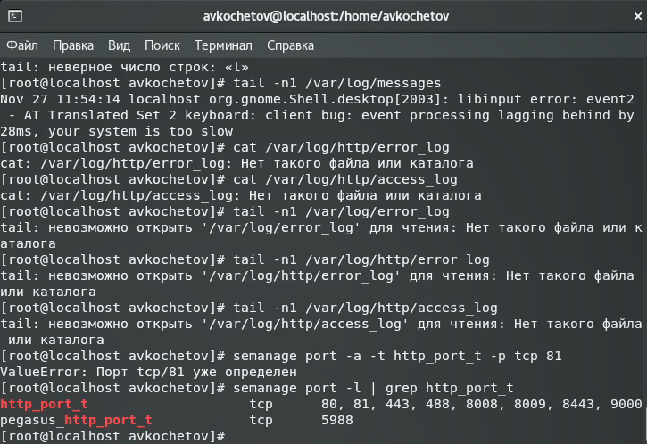{ #fig:013 width=60% }

---

14. Снова зашел на сервер и увидел, что он работает. Вернул контекст и listen 80, и удалил привязку к 81(рис.14).

   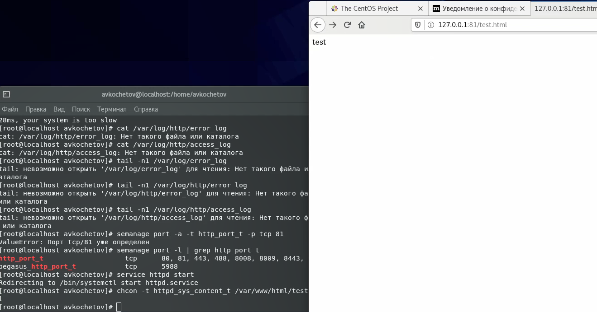{ #fig:014 width=60% }

---

15. Удалил файл test.html(рис.15).

   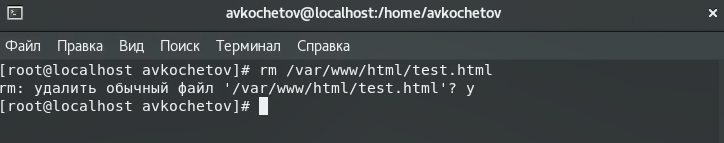{ #fig:015 width=60% }

# Выводы

Развил навыки администрирования ОС Linux. Получил первое практическое знакомство с технологией SELinux1.
Проверил работу SELinx на практике совместно с веб-сервером Apache.

## {.standout}

Спасибо за внимание
