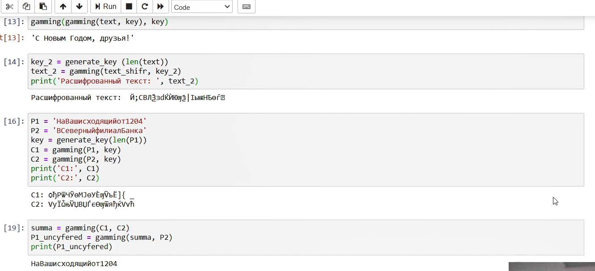

---
## Front matter
lang: ru-RU
title: Отчёт по лабораторной работе 8
author: 'Кочетов Андрей Владимирович'
date: 18 декабря, 2021

## Formatting
toc: false
slide_level: 2
theme: metropolis
mainfont: PT Serif
romanfont: PT Serif
sansfont: PT Sans
monofont: PT Mono
header-includes: 
 - \metroset{progressbar=frametitle,sectionpage=progressbar,numbering=fraction}
 - '\makeatletter'
 - '\beamer@ignorenonframefalse'
 - '\makeatother'
aspectratio: 43
section-titles: true
---

## Цель работы

Освоить на практике применение режима однократного гаммирования на примере кодирования различных исходных текстов одним ключом.

## Задание

Написание программы по шифрованию.

# Выполнение лабораторной работы

1. Выбрал язык программирования(Python) и написал начало программы, как в предыдущей лабораторной работе(рис.1).

   { #fig:001 width=60% }

---

2. Дописал программу и дешифровал текст без использования ключа(рис.2).

   { #fig:002 width=60% }

# Выводы

Освоил на практике применение режима однократного гаммирования на примере кодирования различных исходных текстов одним ключом.

## {.standout}

Спасибо за внимание
